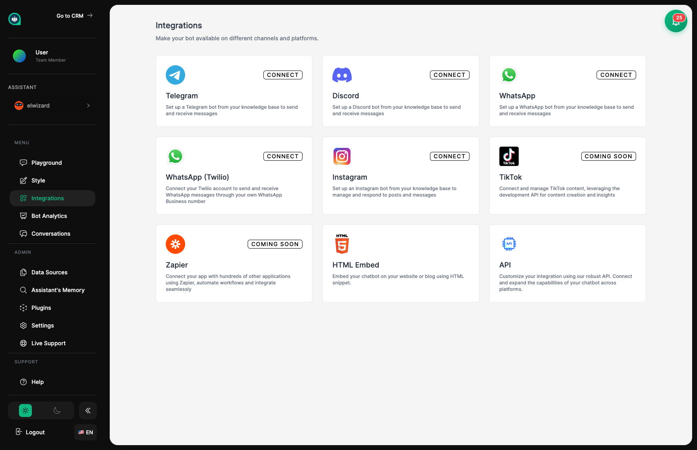

import { Aside, Badge, Card, CardGrid, LinkCard, Steps, Tabs, TabItem } from '@astrojs/starlight/components';

All API requests must be authenticated using an API key. This guide covers how to generate and use API keys securely. <Badge text="Security" variant="caution" size="small" />



## Generating an API Key

<Steps>
1. **Navigate to Settings**
   
   Go to **Settings → API Keys** in your dashboard.

2. **Click Generate New Key**
   
   Start the key generation process.

3. **Name your key**
   
   Give it a descriptive name (e.g., "Production Server", "Development").

4. **Copy and store securely**
   
   **⚠️ The key won't be shown again!** Store it immediately in a secure location.
</Steps>

<Aside type="danger" title="Security Warning">
**Never expose your API key in:**
- Client-side code (JavaScript in the browser)
- Public repositories (GitHub, GitLab, etc.)
- Application logs
- Error messages

Treat your API key like a password. If compromised, revoke it immediately.
</Aside>

## Using Your API Key

Include your API key in the `Authorization` header of all requests:

<Tabs>
  <TabItem label="cURL">
    ```bash
    curl -X POST https://api.mygptassistants.com/api/v1/chat/YOUR_BOT_ID/message \
      -H "Authorization: Bearer YOUR_API_KEY" \
      -H "Content-Type: application/json" \
      -d '{"message": "Hello"}'
    ```
  </TabItem>
  <TabItem label="JavaScript">
    ```javascript
    const response = await fetch('https://api.mygptassistants.com/api/v1/chat/BOT_ID/message', {
      method: 'POST',
      headers: {
        'Authorization': `Bearer ${process.env.MGA_API_KEY}`,
        'Content-Type': 'application/json',
      },
      body: JSON.stringify({ message: 'Hello' }),
    });
    ```
  </TabItem>
  <TabItem label="Python">
    ```python
    import requests
    import os

    response = requests.post(
        'https://api.mygptassistants.com/api/v1/chat/BOT_ID/message',
        headers={
            'Authorization': f'Bearer {os.environ["MGA_API_KEY"]}',
            'Content-Type': 'application/json',
        },
        json={'message': 'Hello'},
    )
    ```
  </TabItem>
</Tabs>

## Key Permissions

<CardGrid>
  <Card title="Read" icon="magnifier">
    View conversations and bot settings. Safe for analytics and monitoring.
  </Card>
  <Card title="Write" icon="pencil">
    Send messages and update settings. Required for most integrations.
  </Card>
  <Card title="Admin" icon="setting">
    **<Badge text="Full Access" variant="danger" size="small" />**
    
    Full access including key management. Use sparingly.
  </Card>
</CardGrid>

| Permission | Capabilities |
|------------|-------------|
| `read` | View conversations, bot settings, analytics |
| `write` | Send messages, update settings, manage conversations |
| `admin` | All above + key management, team settings |

<Aside type="caution" title="Principle of Least Privilege">
Always use the minimum permission level needed. If your integration only needs to read data, don't request write or admin access.
</Aside>

## Secure Key Storage

<Tabs>
  <TabItem label="Environment Variables">
    **Recommended for most cases**
    
    ```bash
    # .env file (never commit this!)
    MGA_API_KEY=your_api_key_here
    ```
    
    ```javascript
    // Access in code
    const apiKey = process.env.MGA_API_KEY;
    ```
  </TabItem>
  <TabItem label="Secrets Management">
    **For production deployments**
    
    Use your platform's secrets management:
    
    | Platform | Service |
    |----------|---------|
    | AWS | Secrets Manager |
    | GCP | Secret Manager |
    | Azure | Key Vault |
    | Vercel | Environment Variables |
    | Railway | Variables |
  </TabItem>
</Tabs>

<Aside type="tip" title="Environment Variables">
Store your API key in environment variables rather than hardcoding it. Use `.env` files for local development and your platform's secrets management for production.
</Aside>

## Revoking Keys

<Steps>
1. **Go to Settings**
   
   Navigate to **Settings → API Keys**.

2. **Find the key**
   
   Locate the key you want to revoke in the list.

3. **Click Revoke**
   
   Select the revoke option for that key.

4. **Confirm**
   
   Verify you want to revoke the key.
</Steps>

<Aside type="caution" title="Immediate Effect">
Revoked keys **stop working immediately**. Make sure you've updated all applications using the key before revoking it.
</Aside>

## Key Rotation

<Steps>
1. **Create a new key**
   
   Generate a new API key in your dashboard.

2. **Update applications**
   
   Deploy the new key to all your applications.

3. **Verify functionality**
   
   Ensure all integrations work with the new key.

4. **Revoke the old key**
   
   Once confirmed, revoke the previous key.
</Steps>

<Aside type="tip" title="Key Rotation Best Practice">
Rotate your API keys periodically (every 90 days recommended) for enhanced security. Set calendar reminders to maintain a regular rotation schedule.
</Aside>

## Authentication Errors

| Error Code | Description | Solution |
|------------|-------------|----------|
| `401 Unauthorized` | Missing or invalid API key | Check header format |
| `403 Forbidden` | Key lacks required permission | Use key with correct permissions |
| `429 Too Many Requests` | Rate limit exceeded | Implement backoff and retry |

## Security Checklist

<CardGrid>
  <Card title="Environment Variables" icon="approve">
    Store keys in env vars, not code.
  </Card>
  <Card title=".gitignore" icon="document">
    Ensure `.env` is in `.gitignore`.
  </Card>
  <Card title="Minimal Permissions" icon="setting">
    Use the least privilege needed.
  </Card>
  <Card title="Regular Rotation" icon="random">
    Rotate keys every 90 days.
  </Card>
</CardGrid>

## Related Topics

<CardGrid>
  <LinkCard
    title="API Overview"
    description="API basics and rate limits"
    href="/api/overview/"
  />
  <LinkCard
    title="Chat API"
    description="Send and receive messages"
    href="/api/chat-api/"
  />
  <LinkCard
    title="Webhooks"
    description="Receive real-time notifications"
    href="/api/webhooks/"
  />
  <LinkCard
    title="Settings"
    description="Bot configuration options"
    href="/assistants/settings/"
  />
</CardGrid>
