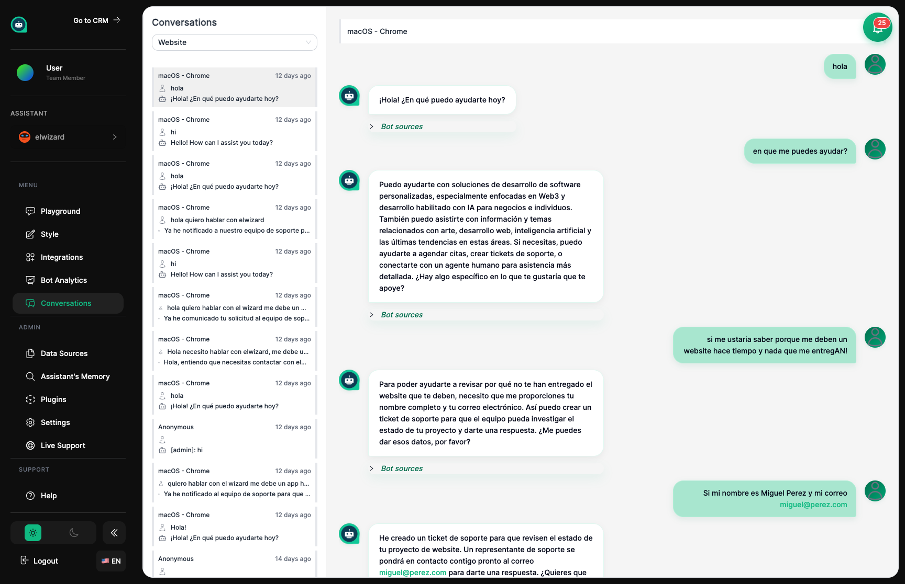

import { Aside, Badge, Card, CardGrid, LinkCard, Steps } from '@astrojs/starlight/components';

## Reviewing Your Assistant's Work <Badge text="Live Data" variant="success" size="small" />

The Conversations page is like sitting in on your assistant's interactions with customers. You can read through every chat they've had, see what questions customers are asking, and check if your assistant is doing a good job. Think of it as a performance review for your team member.

## What You Can See

<CardGrid>
  <Card title="Complete Transcripts" icon="document">
    Read every word of each conversation, with timestamps showing when things happened.
  </Card>
  <Card title="All Channels" icon="external">
    See conversations from everywhere – your website, Instagram, WhatsApp, and more.
  </Card>
  <Card title="Find Specific Chats" icon="magnifier">
    Search for particular conversations by keyword, date, or where they happened.
  </Card>
  <Card title="Watch Live" icon="rocket">
    **<Badge text="Live" variant="success" size="small" />** See conversations as they're happening in real-time.
  </Card>
</CardGrid>

## Browsing Conversations

Conversations are listed with the newest ones at the top. You can see when each chat happened, which platform it came from, and a preview of what was discussed. Click any conversation to read the full exchange.

<Aside type="tip" title="Regular Check-ins">
- Review recent conversations **every day or week** to catch issues early
- Look for patterns – if many customers ask the same thing, your assistant might need better training
- Notice which platform each conversation came from
- Mark conversations that need follow-up from a human
</Aside>

## Finding Specific Conversations

Use the search box to find chats about particular topics or keywords.

<CardGrid>
  <Card title="Search by Topic" icon="magnifier">
    Find mentions of specific products, features, or issues.
  </Card>
  <Card title="Filter by Date" icon="document">
    Look at specific time periods, like before and after you made changes.
  </Card>
  <Card title="Filter by Channel" icon="external">
    See only conversations from your website, Instagram, or other platforms.
  </Card>
</CardGrid>

<Aside type="tip" title="Search Tips">
- Search for **product names** to see what customers ask about them
- Look up **problem words** like "issue" or "broken" to find complaints
- Filter by **date** to see how things changed after training updates
- Compare **different channels** to see if performance varies
</Aside>

## Learning from Real Interactions

<Steps>
1. **Review regularly**
   
   Set aside time each day or week to read through recent conversations.

2. **Spot patterns**
   
   Notice questions that come up often or points where customers seem confused.

3. **Mark issues**
   
   Flag conversations where your assistant struggled – these show where to improve.

4. **Take action**
   
   Update training materials or settings based on what you learn.
</Steps>

<Aside type="note" title="Signs Your Assistant Needs Help">
- **Customer rephrases multiple times** – Your assistant isn't understanding → add clearer training materials
- **"I don't know" responses** – Missing knowledge → add information on that topic
- **Wrong answers** – Check and correct the training materials
- **Happy customers** – Note what's working well so you can do more of it
</Aside>

## Quality Checklist

Use conversations as a quality check for your assistant:

| Check For | What to Look For |
|-----------|-----------------|
| **Accuracy** | Are the answers correct and current? |
| **Friendliness** | Does your assistant sound helpful and on-brand? |
| **Relevance** | Do they stay on topic and address the question? |
| **Completeness** | Are answers thorough enough? |
| **Handoff** | Does escalation to humans work smoothly? |

<Aside type="tip" title="Pro Tip">
Create a **quality scorecard** with these criteria. Rate a sample of conversations each week to track how your assistant improves over time.
</Aside>

## What You Can Do with Conversations

<CardGrid>
  <Card title="Export" icon="document">
    Download conversation records for review or compliance purposes.
  </Card>
  <Card title="Delete" icon="close">
    Remove conversations when required for privacy reasons.
  </Card>
  <Card title="Hand Off" icon="comment">
    Transfer live conversations to a human team member when needed.
  </Card>
</CardGrid>

<Aside type="caution" title="Privacy Reminder">
Be mindful of data privacy rules (like GDPR or CCPA). Set up policies for how long to keep conversations and delete them when required.
</Aside>

## Related Topics

<CardGrid>
  <LinkCard
    title="Analytics"
    description="See the big picture of how your assistant is performing"
    href="/assistants/analytics/"
  />
  <LinkCard
    title="Data Sources"
    description="Add training materials to improve your assistant's answers"
    href="/assistants/data-sources/"
  />
  <LinkCard
    title="Playground"
    description="Practice and test improvements before going live"
    href="/assistants/playground/"
  />
  <LinkCard
    title="CRM Contacts"
    description="Connect conversations to customer profiles"
    href="/crm/contacts/"
  />
</CardGrid>
