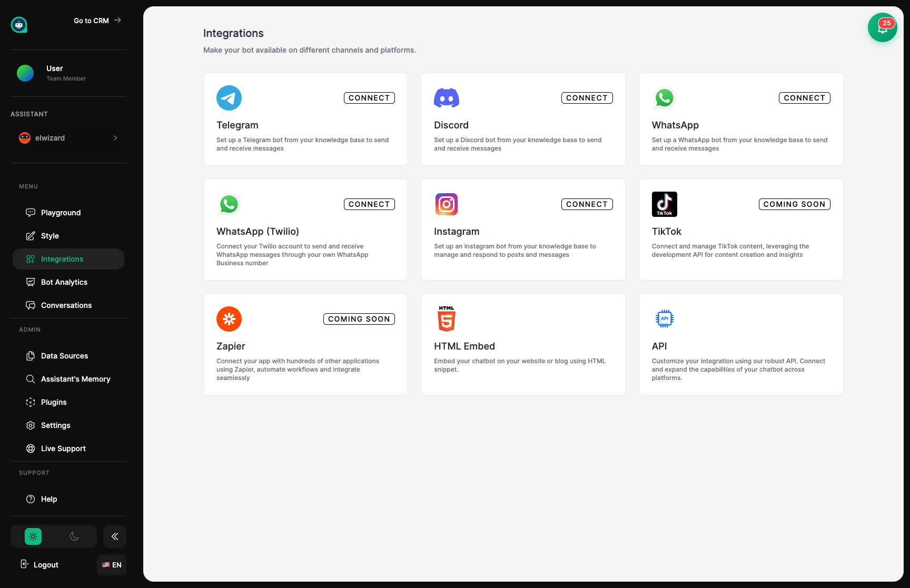

import { Aside, Badge, Card, CardGrid, LinkCard, Steps, Tabs, TabItem } from '@astrojs/starlight/components';

## Send Your Assistant Where Customers Are <Badge text="Multi-Channel" variant="tip" size="small" />

Integrations let you deploy your trained assistant to different places – your website, Instagram, WhatsApp, LinkedIn, and more. Think of it like assigning your team member to different locations where customers need help.

## Where Your Assistant Can Work

<CardGrid>
  <Card title="Your Website" icon="external">
    **<Badge text="Popular" variant="success" size="small" />**
    
    Add a chat bubble to your website. Visitors click it to start chatting with your assistant instantly.
    
    [Setup Guide →](/assistants/embed/)
  </Card>
  <Card title="Instagram DMs" icon="star">
    **<Badge text="Popular" variant="success" size="small" />**
    
    Your assistant answers Instagram direct messages automatically, helping customers 24/7.
  </Card>
  <Card title="WhatsApp" icon="phone">
    Connect to WhatsApp by scanning a QR code — no Business API approval required. Your assistant replies to customers on their favorite messaging app.
  </Card>
  <Card title="Telegram" icon="comment">
    Deploy your assistant as a Telegram bot – great for communities and ongoing support.
  </Card>
  <Card title="Facebook Messenger" icon="comment">
    **<Badge text="New" variant="tip" size="small" />**
    
    Connect your Facebook Page inbox so your assistant answers Messenger conversations automatically.
  </Card>
  <Card title="LinkedIn" icon="comment">
    **<Badge text="New" variant="tip" size="small" />**
    
    Your assistant handles LinkedIn direct messages, ideal for B2B outreach and lead qualification.
  </Card>
  <Card title="Discord" icon="setting">
    Add your assistant to Discord servers for gaming communities or tech support.
  </Card>
  <Card title="WordPress Plugin" icon="external">
    **<Badge text="Native Plugin" variant="success" size="small" />**
    
    Install the native WordPress plugin for a seamless embed with a settings panel.
    
    [Plugin Guide →](/assistants/wordpress-plugin/)
  </Card>
  <Card title="Custom Apps" icon="setting">
    **<Badge text="For Developers" variant="note" size="small" />**
    
    Build your own integration using our full REST API.
    
    [API Docs →](/api/overview/)
  </Card>
</CardGrid>

## Website Chat

The easiest way to deploy your assistant is adding them to your website. You get a small piece of code to paste into your site, and your assistant appears as a friendly chat bubble in the corner.

<Steps>
1. **Go to the Embed page** in your dashboard

2. **Copy the code** provided

3. **Paste it into your website** (before the closing `</body>` tag)

4. **Test the chat** on your live site
</Steps>

<Aside type="tip" title="Website Tips">
- The code goes in your HTML, usually at the bottom of the page
- You can choose which corner the chat bubble appears in
- Test on different browsers to make sure everything works
- The chat works automatically on mobile devices too
</Aside>

## Instagram Messaging <Badge text="Business Account Required" variant="caution" size="small" />

Connect your assistant to Instagram so they can respond to direct messages automatically.

<Steps>
1. **Connect your Instagram Business account**

2. **Set up how your assistant should respond**

3. **Make sure your assistant knows** common Instagram customer questions

4. **Test by sending a DM** to your own account
</Steps>

<Aside type="tip" title="Instagram Requirements">
- You need an **Instagram Business** or **Creator** account
- Your assistant responds to **direct messages only**, not comments
- You can turn off automatic replies during business hours if you prefer to respond personally
- You may need to connect through Facebook
</Aside>

<Aside type="note" title="Good Practices">
- Let followers know in your bio that they might chat with an automated assistant
- Set up a way to transfer to humans for complex questions
- Keep an eye on conversation quality in Analytics
</Aside>

## WhatsApp Business <Badge text="QR Code Setup" variant="tip" size="small" />

Connect to WhatsApp by scanning a QR code — no Business API approval or Meta verification required. Your WhatsApp session is linked directly through the QR code scan in your dashboard.

<CardGrid>
  <Card title="What You Need" icon="document">
    - A WhatsApp account (personal or business)
    - Your phone nearby to scan the QR code
  </Card>
  <Card title="What You Get" icon="star">
    - 24/7 automated customer help
    - Customer info synced with your CRM
    - Full conversation history in your inbox
  </Card>
</CardGrid>

<Steps>
1. **Open the WhatsApp integration** in your dashboard

2. **Scan the QR code** with your WhatsApp app (Settings → Linked Devices)

3. **Wait for the connection** to activate (usually under 30 seconds)

4. **Test by sending a message** to the connected number
</Steps>

<Aside type="caution" title="Session Management">
Your WhatsApp session may occasionally disconnect and require re-scanning. The dashboard will alert you when reconnection is needed.
</Aside>

## Facebook Messenger <Badge text="New" variant="tip" size="small" />

Connect your Facebook Page so your assistant automatically handles Messenger conversations.

<Steps>
1. **Link your Facebook Page** from the Messenger integration settings

2. **Authorize the connection** via Facebook's OAuth flow

3. **Test by messaging** your Facebook Page from another account
</Steps>

## LinkedIn Messages <Badge text="New" variant="tip" size="small" />

Your assistant can respond to LinkedIn direct messages — ideal for B2B outreach, lead qualification, and professional customer support.

<Steps>
1. **Connect your LinkedIn account** from the LinkedIn integration settings

2. **Authorize access** to your LinkedIn messages

3. **Test by sending a DM** to your connected profile
</Steps>

<Aside type="note" title="LinkedIn Use Cases">
LinkedIn is best suited for B2B scenarios: sales outreach, lead qualification, professional support. Keep your assistant's tone formal and professional.
</Aside>

## Telegram Bot

Deploy your assistant as a Telegram bot.

<Steps>
1. **Create a bot** with [@BotFather](https://t.me/BotFather) on Telegram

2. **Copy the token** you receive

3. **Paste the token** into your Telegram integration settings

4. **Test your bot** by messaging it on Telegram
</Steps>

## Custom Integration <Badge text="For Developers" variant="note" size="small" />

For developers: use the API to integrate your assistant into your own applications.

<CardGrid>
  <Card title="Full Access" icon="setting">
    Complete control over conversations, contacts, settings, and analytics.
  </Card>
  <Card title="Real-Time Updates" icon="rocket">
    Get instant notifications when new messages arrive or conversations start.
  </Card>
  <Card title="Code Libraries" icon="document">
    Pre-built tools for JavaScript, Python, and other languages.
  </Card>
</CardGrid>

<Aside type="note" title="Developer Resources">
Check out the [API Reference](/api/overview/) for detailed documentation on building custom integrations.
</Aside>

## Comparing Your Options

| Platform | Setup Time | Best For | What You Need |
|----------|------------|----------|---------------|
| Website | 5 minutes | Most businesses | Access to edit your site |
| WordPress | 5 minutes | WordPress sites | Admin access to WP |
| Instagram | 15 minutes | Social media brands | Business account |
| WhatsApp | 5 minutes | Customer support | Phone with WhatsApp |
| Facebook Messenger | 15 minutes | Facebook businesses | Facebook Page admin |
| LinkedIn | 10 minutes | B2B businesses | LinkedIn account |
| Telegram | 10 minutes | Communities | Bot token |
| Discord | 10 minutes | Gaming/Tech communities | Server admin rights |
| Custom API | Varies | Unique needs | Development skills |

## Related Topics

<CardGrid>
  <LinkCard
    title="Embed Widget"
    description="Get the code to add your assistant to your website"
    href="/assistants/embed/"
  />
  <LinkCard
    title="API Overview"
    description="Documentation for building custom integrations"
    href="/api/overview/"
  />
  <LinkCard
    title="Analytics"
    description="See which platforms your customers prefer"
    href="/assistants/analytics/"
  />
  <LinkCard
    title="Plugins"
    description="Add more skills to your assistant"
    href="/assistants/plugins/"
  />
</CardGrid>
