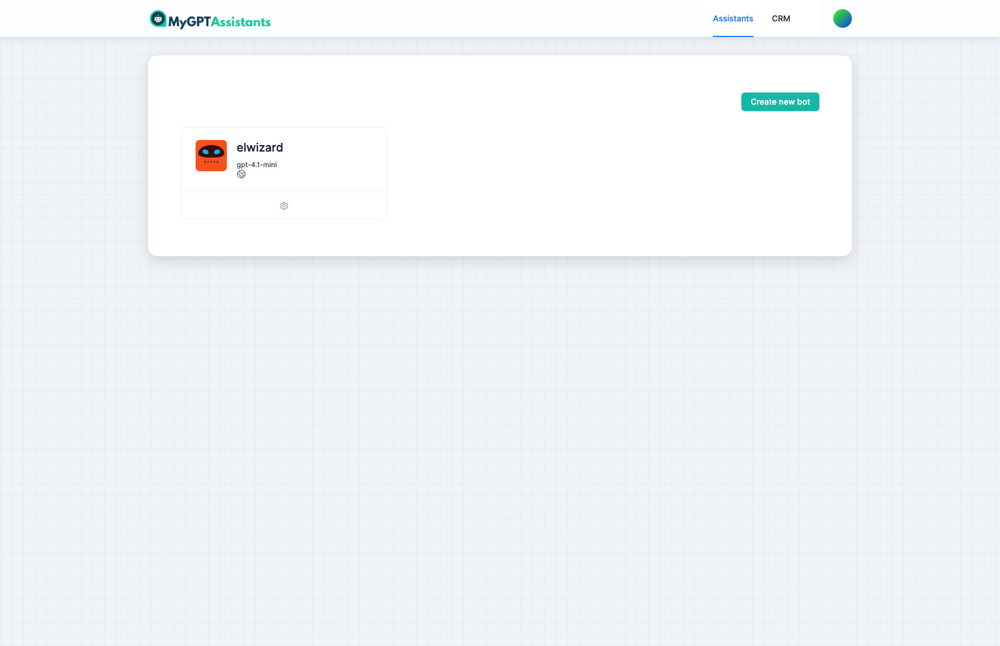
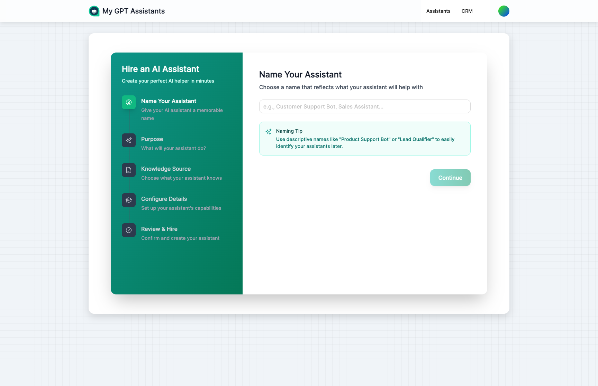
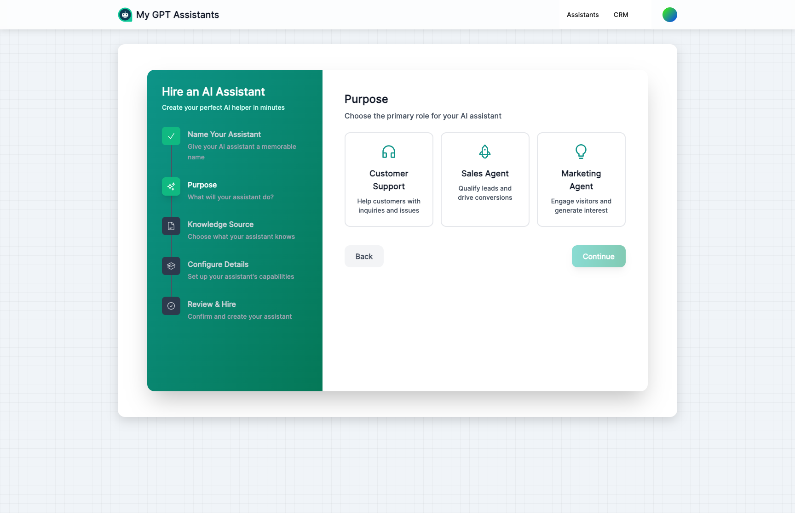
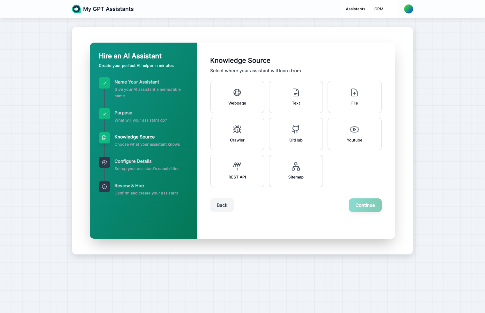

import { Aside, Badge, Card, CardGrid, LinkCard, Steps } from '@astrojs/starlight/components';

Welcome to the AI Assistants documentation! Think of your AI assistant as a new team member you're bringing on board. Just like training a new employee, you'll teach them about your business, show them how to talk to customers, and help them learn your company's way of doing things.

## Creating Your First Assistant

Creating a new assistant is easy with our step-by-step wizard:

<Steps>
1. **Name Your Assistant**
   
   Give your assistant a unique name and choose who can access it (public, private, or contacts-only).
   
   

2. **Define Their Purpose**
   
   Choose from preset roles like Customer Support Agent, Sales Representative, or create a custom role. This shapes how your assistant will behave.
   
   

3. **Add Initial Knowledge**
   
   Point your assistant to your website or upload documents so they can start learning about your business right away.
   
   
</Steps>

## Getting Started

MyGPTAssistants lets you create your own virtual team members that can:
- Greet and help customers around the clock, even while you sleep
- Chat with visitors on your website and social media
- Learn everything about your business from the materials you share
- Handle tasks like booking appointments and answering common questions

<Aside type="tip" title="Your First Steps">
<Steps>
1. **Hire your new assistant** by creating one from the dashboard
2. **Train them** by sharing your company materials and knowledge
3. **Interview them** in the Playground to see how they handle questions
4. **Put them to work** by adding them to your website
</Steps>
</Aside>

## What You Can Do

### Interview & Practice <Badge text="Essential" variant="success" size="small" />

<CardGrid>
  <Card title="Playground" icon="rocket">
    Think of this as a practice interview room. Test how your assistant handles questions before they meet real customers. It's a safe space to see their strengths and areas for improvement.
    
    [Go to Playground →](/assistants/playground/)
  </Card>
  <Card title="Search" icon="magnifier">
    Check what your assistant has learned. Ask a question and see if they can find the right answer from their training materials.
    
    [Go to Search →](/assistants/search/)
  </Card>
</CardGrid>

### Personality & Style <Badge text="Brand Your Bot" variant="tip" size="small" />

<CardGrid>
  <Card title="Appearance" icon="pencil">
    Dress your assistant for success! Choose colors and styles that match your brand, just like giving them a company uniform.
    
    [Go to Appearance →](/assistants/appearance/)
  </Card>
  <Card title="Settings" icon="setting">
    Define your assistant's personality and how they should behave. Are they formal or casual? Helpful or brief? You decide!
    
    [Go to Settings →](/assistants/settings/)
  </Card>
</CardGrid>

### Training & Skills <Badge text="Core Feature" variant="note" size="small" />

<CardGrid>
  <Card title="Data Sources" icon="document">
    Share your training materials! Upload documents, share website links, or type information directly. Everything you share helps your assistant learn about your business.
    
    [Go to Data Sources →](/assistants/data-sources/)
  </Card>
  <Card title="Plugins" icon="puzzle">
    Give your assistant new abilities like booking appointments, sending emails, or connecting to other tools you use.
    
    [Go to Plugins →](/assistants/plugins/)
  </Card>
</CardGrid>

### Deployment & Performance <Badge text="Grow & Track" variant="tip" size="small" />

<CardGrid>
  <Card title="Embed" icon="external">
    Put your trained assistant to work on your website. Just copy a small piece of code and they're ready to greet visitors!
    
    [Go to Embed →](/assistants/embed/)
  </Card>
  <Card title="Integrations" icon="phone">
    Let your assistant work on Instagram, Telegram, WhatsApp, and other platforms where your customers hang out.
    
    [Go to Integrations →](/assistants/integrations/)
  </Card>
  <Card title="Analytics" icon="graph">
    Review your assistant's performance. See how many customers they've helped and what questions come up most often.
    
    [Go to Analytics →](/assistants/analytics/)
  </Card>
  <Card title="Conversations" icon="comment">
    Read through past conversations to see how your assistant is doing. It's like reviewing their work to ensure quality.
    
    [Go to Conversations →](/assistants/conversations/)
  </Card>
</CardGrid>

## Next Steps

<CardGrid>
  <LinkCard
    title="Test in Playground"
    description="Start experimenting with your bot in a safe environment"
    href="/assistants/playground/"
  />
  <LinkCard
    title="Add Data Sources"
    description="Teach your assistant about your business"
    href="/assistants/data-sources/"
  />
  <LinkCard
    title="Customize Appearance"
    description="Match the widget to your brand"
    href="/assistants/appearance/"
  />
  <LinkCard
    title="Embed on Website"
    description="Go live with your AI assistant"
    href="/assistants/embed/"
  />
</CardGrid>
