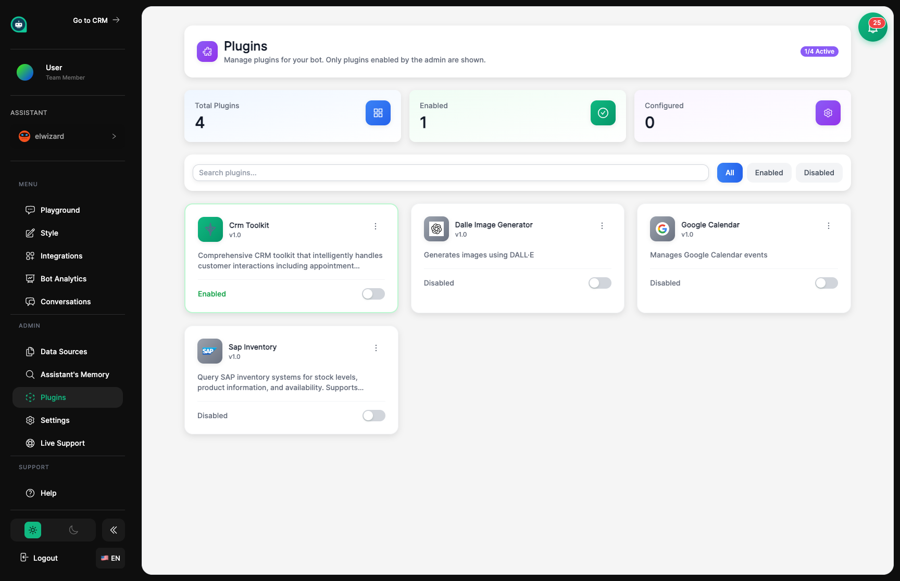

import { Aside, Badge, Card, CardGrid, LinkCard, Steps, Tabs, TabItem } from '@astrojs/starlight/components';

## Teaching Your Assistant New Skills <Badge text="Extensible" variant="note" size="small" />

Plugins are like specialized training courses for your assistant. They add new abilities your assistant couldn't do otherwise – like scheduling appointments, sending emails, or processing payments. Just like sending an employee to a training course, plugins expand what your assistant can do for customers.



## Available Skills to Add

<CardGrid>
  <Card title="Appointment Booking" icon="phone">
    **<Badge text="Popular" variant="success" size="small" />**
    
    Let your assistant schedule meetings directly with customers. Connects with your calendar.
  </Card>
  <Card title="Email Sending" icon="email">
    **<Badge text="Popular" variant="success" size="small" />**
    
    Your assistant can send emails for follow-ups, confirmations, and more.
  </Card>
  <Card title="Form Collection" icon="document">
    Help your assistant gather structured information from customers with validated forms.
  </Card>
  <Card title="Payment Processing" icon="approve">
    **<Badge text="Beta" variant="caution" size="small" />**
    
    Let your assistant handle secure transactions through Stripe or PayPal.
  </Card>
  <Card title="CRM Connection" icon="add-document">
    **<Badge text="New" variant="tip" size="small" />**
    
    Automatically add and update customer information in your CRM from conversations.
  </Card>
  <Card title="Custom Actions" icon="setting">
    Connect your assistant to your own systems for custom business tasks.
  </Card>
</CardGrid>

<Aside type="tip" title="Choosing Skills">
- **Only add skills your assistant actually needs** – too many can be confusing
- **Read what each plugin does** before enabling it
- **Some plugins need extra setup** like connecting to external services
</Aside>

## Adding New Skills

<Steps>
1. **Browse available plugins**
   
   Look through the list of skills you can give your assistant.

2. **Read the description**
   
   Understand what the skill does and what access it needs.

3. **Enable the plugin**
   
   Turn it on to make the skill available to your assistant.

4. **Set it up**
   
   Provide any needed information like connection details or preferences.

5. **Test in Playground**
   
   Make sure your assistant uses the new skill correctly before customers try it.
</Steps>

## Setting Up Skills

After enabling a plugin, click settings to configure it. You might need to connect to external services, provide account information, or set rules for when your assistant should use this skill.

<Tabs>
  <TabItem label="Setup Types">
    | Type | What You'll Need |
    |------|-----------------|
    | **Connections** | Login info for external services |
    | **Notifications** | Where to send alerts when something happens |
    | **Triggers** | Rules for when your assistant should use this skill |
    | **Permissions** | What information the plugin can access |
  </TabItem>
  <TabItem label="When to Use Skills">
    | Trigger | When Your Assistant Uses the Skill |
    |---------|-----------------------------------|
    | **Auto-Detect** | When they recognize a customer wants this |
    | **Keywords** | When the customer says certain words |
    | **Always Available** | Your assistant can use it anytime it makes sense |
    | **On Request Only** | Only when the customer specifically asks |
  </TabItem>
</Tabs>

<Aside type="tip" title="Setup Tips">
- **Follow the setup instructions** step by step
- **Test in Playground** before letting customers use new skills
- **Some skills need accounts** with other services (like Calendly for scheduling)
</Aside>

## What Plugins Can Access

<Aside type="caution" title="Check Before Enabling">
Some plugins need access to customer information or external services. Review what each plugin needs before turning it on, and make sure you're comfortable with what it can see and do.
</Aside>

<CardGrid>
  <Card title="Customer Info" icon="document">
    What customer details the plugin can see.
  </Card>
  <Card title="External Services" icon="external">
    Which third-party tools the plugin connects to.
  </Card>
  <Card title="Actions" icon="setting">
    What the plugin can do (send emails, create records, etc.).
  </Card>
</CardGrid>

## Building Custom Skills <Badge text="Advanced" variant="default" size="small" />

For those who want to build their own plugins:

```javascript
// Example: Custom skill
{
  "name": "check_inventory",
  "description": "Check how many items are in stock",
  "parameters": {
    "product_id": "string"
  },
  "endpoint": "https://your-api.com/inventory"
}
```

<Aside type="note" title="Developer Resources">
See the [API Reference](/api/overview/) for complete documentation on building custom plugins.
</Aside>

## Tips for Success

<Steps>
1. **Start with what you need**
   
   More plugins = more complexity. Start simple.

2. **Test everything**
   
   Make sure skills work correctly in all situations.

3. **Set clear rules**
   
   Help your assistant know exactly when to use each skill.

4. **Watch the results**
   
   Use Analytics to see which skills are most valuable.
</Steps>

## Skill Status Guide

| Status | What It Means |
|--------|--------------|
| **<Badge text="Popular" variant="success" size="small" />** | Widely used and reliable |
| **<Badge text="New" variant="tip" size="small" />** | Recently added skill |
| **<Badge text="Beta" variant="caution" size="small" />** | Still in testing, may change |
| **<Badge text="Advanced" variant="default" size="small" />** | Needs some technical setup |

## Related Topics

<CardGrid>
  <LinkCard
    title="Settings"
    description="Adjust your assistant's overall behavior"
    href="/assistants/settings/"
  />
  <LinkCard
    title="Playground"
    description="Test new skills before going live"
    href="/assistants/playground/"
  />
  <LinkCard
    title="Integrations"
    description="Connect to messaging platforms"
    href="/assistants/integrations/"
  />
  <LinkCard
    title="API Overview"
    description="Build custom skills"
    href="/api/overview/"
  />
</CardGrid>
