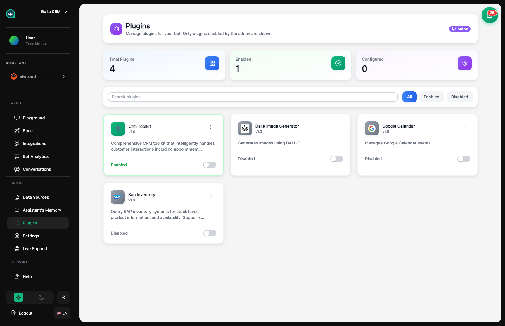

import { Aside, Badge, Card, CardGrid, LinkCard, Steps, Tabs, TabItem } from '@astrojs/starlight/components';

## Teaching Your Assistant New Skills <Badge text="Extensible" variant="note" size="small" />

Plugins extend what your assistant can do beyond answering questions. Enable the right plugins and your assistant can schedule meetings, hand off to a human agent, manage your CRM, and even help customers on your WordPress site.



## Available Plugins

<CardGrid>
  <Card title="CRM Toolkit" icon="group">
    **<Badge text="Core" variant="success" size="small" />**
    
    Gives your assistant full CRM powers: create contacts, qualify leads, create tickets, schedule appointments, detect and escalate to human agents, and take structured notes from conversations.
  </Card>
  <Card title="Appointment Booking" icon="document">
    **<Badge text="Popular" variant="success" size="small" />**
    
    Part of the CRM Toolkit — your assistant can check availability and book appointments directly with customers. Syncs with Google Calendar and sends branded confirmation emails.
    
    [Appointments guide →](/crm/appointments/)
  </Card>
  <Card title="Human Handoff" icon="phone">
    **<Badge text="Popular" variant="success" size="small" />**
    
    Transfers a conversation to a live human agent when the customer needs real help. AI monitors conversation sentiment and can trigger handoff automatically.
    
    [Live escalation guide →](/crm/live-escalation/)
  </Card>
  <Card title="WordPress Tools" icon="external">
    **<Badge text="WordPress" variant="note" size="small" />**
    
    Lets your assistant search your WordPress site's posts, pages, and products to give customers accurate, up-to-date answers from your actual website content.
    
    [WordPress Plugin →](/assistants/wordpress-plugin/)
  </Card>
  <Card title="Custom Actions" icon="setting">
    Connect your assistant to your own systems and APIs for custom business workflows.
  </Card>
</CardGrid>

<Aside type="tip" title="Choosing Skills">
- **Only add skills your assistant actually needs** – too many can confuse responses
- **The CRM Toolkit enables most sales and support workflows** in one plugin
- **Human Handoff is recommended for any production assistant** so customers can always reach a real person
</Aside>

## Adding New Skills

<Steps>
1. **Browse available plugins**
   
   Look through the list of skills you can give your assistant.

2. **Read the description**
   
   Understand what the skill does and what access it needs.

3. **Enable the plugin**
   
   Turn it on to make the skill available to your assistant.

4. **Set it up**
   
   Provide any needed information like connection details or preferences.

5. **Test in Playground**
   
   Make sure your assistant uses the new skill correctly before customers try it.
</Steps>

## Setting Up Skills

After enabling a plugin, click settings to configure it. You might need to connect to external services, provide account information, or set rules for when your assistant should use this skill.

<Tabs>
  <TabItem label="Setup Types">
    | Type | What You'll Need |
    |------|-----------------|
    | **Connections** | Login info for external services |
    | **Notifications** | Where to send alerts when something happens |
    | **Triggers** | Rules for when your assistant should use this skill |
    | **Permissions** | What information the plugin can access |
  </TabItem>
  <TabItem label="When to Use Skills">
    | Trigger | When Your Assistant Uses the Skill |
    |---------|-----------------------------------|
    | **Auto-Detect** | When they recognize a customer wants this |
    | **Keywords** | When the customer says certain words |
    | **Always Available** | Your assistant can use it anytime it makes sense |
    | **On Request Only** | Only when the customer specifically asks |
  </TabItem>
</Tabs>

<Aside type="tip" title="Setup Tips">
- **Follow the setup instructions** step by step
- **Test in Playground** before letting customers use new skills
- **Some skills need accounts** with other services (like Calendly for scheduling)
</Aside>

## What Plugins Can Access

<Aside type="caution" title="Check Before Enabling">
Some plugins need access to customer information or external services. Review what each plugin needs before turning it on, and make sure you're comfortable with what it can see and do.
</Aside>

<CardGrid>
  <Card title="Customer Info" icon="document">
    What customer details the plugin can see.
  </Card>
  <Card title="External Services" icon="external">
    Which third-party tools the plugin connects to.
  </Card>
  <Card title="Actions" icon="setting">
    What the plugin can do (send emails, create records, etc.).
  </Card>
</CardGrid>

## Building Custom Skills <Badge text="Advanced" variant="default" size="small" />

For those who want to build their own plugins:

```javascript
// Example: Custom skill
{
  "name": "check_inventory",
  "description": "Check how many items are in stock",
  "parameters": {
    "product_id": "string"
  },
  "endpoint": "https://your-api.com/inventory"
}
```

<Aside type="note" title="Developer Resources">
See the [API Reference](/api/overview/) for complete documentation on building custom plugins.
</Aside>

## Tips for Success

<Steps>
1. **Start with what you need**
   
   More plugins = more complexity. Start simple.

2. **Test everything**
   
   Make sure skills work correctly in all situations.

3. **Set clear rules**
   
   Help your assistant know exactly when to use each skill.

4. **Watch the results**
   
   Use Analytics to see which skills are most valuable.
</Steps>

## Skill Status Guide

| Status | What It Means |
|--------|--------------|
| **<Badge text="Popular" variant="success" size="small" />** | Widely used and reliable |
| **<Badge text="New" variant="tip" size="small" />** | Recently added skill |
| **<Badge text="Beta" variant="caution" size="small" />** | Still in testing, may change |
| **<Badge text="Advanced" variant="default" size="small" />** | Needs some technical setup |

## Related Topics

<CardGrid>
  <LinkCard
    title="Settings"
    description="Adjust your assistant's overall behavior"
    href="/assistants/settings/"
  />
  <LinkCard
    title="Playground"
    description="Test new skills before going live"
    href="/assistants/playground/"
  />
  <LinkCard
    title="Integrations"
    description="Connect to messaging platforms"
    href="/assistants/integrations/"
  />
  <LinkCard
    title="API Overview"
    description="Build custom skills"
    href="/api/overview/"
  />
</CardGrid>
