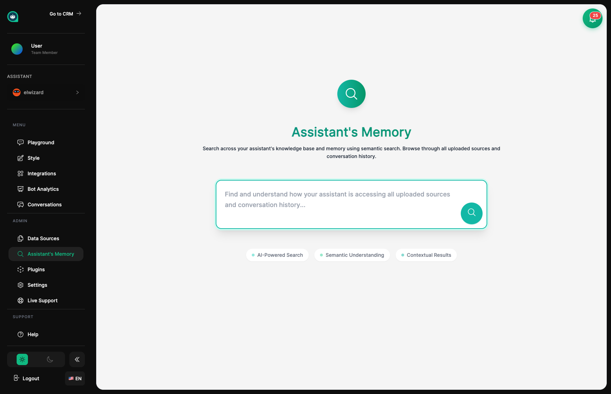

import { Aside, Badge, Card, CardGrid, LinkCard, Steps, Tabs, TabItem } from '@astrojs/starlight/components';

## Testing Your Assistant's Memory <Badge text="Testing Tool" variant="note" size="small" />

The Search page lets you peek into your assistant's brain to see what they've learned. Ask a question and see exactly what information they pull from their training materials. This is like quizzing an employee to make sure they absorbed their training.

## What You Can Do Here

<CardGrid>
  <Card title="Ask Questions" icon="magnifier">
    Type a question just like a customer would and see what your assistant finds.
  </Card>
  <Card title="Check Relevance" icon="graph">
    See how closely each result matches your question (scored from 0 to 1).
  </Card>
  <Card title="Trace Sources" icon="document">
    Know exactly which training material each answer came from.
  </Card>
  <Card title="Find Gaps" icon="warning">
    Discover topics where your assistant needs more training before customers notice.
  </Card>
</CardGrid>

## How to Test Their Knowledge

<Steps>
1. **Ask a question**
   
   Type something a customer might ask, using natural language.

2. **Review what they found**
   
   Look at the information chunks and how relevant each one is.

3. **Verify the source**
   
   Make sure the answers come from accurate, up-to-date training materials.

4. **Note the gaps**
   
   Write down topics that returned no results or poor matches.
</Steps>

When you search, you'll see the most relevant pieces of information from your assistant's training. Each result shows a relevance score (how well it matches your question) and which training material it came from.

<Aside type="tip" title="Understanding Search Results">
- **High scores (above 0.7)** – Your assistant found great information on this topic
- **No results** – Your assistant doesn't know about this! Time to add training materials
- **Check the source** – Make sure the information is current and accurate
- **Try different wording** – Ask the same thing multiple ways to be thorough
</Aside>

## Reading the Results

<Tabs>
  <TabItem label="Relevance Scores">
    | Score | What It Means |
    |-------|--------------|
    | **0.9 - 1.0** | Excellent – Your assistant really knows this |
    | **0.7 - 0.9** | Good – They have solid information |
    | **0.5 - 0.7** | Fair – The info is somewhat related |
    | **Below 0.5** | Weak – They might struggle with this |
  </TabItem>
  <TabItem label="What Each Part Shows">
    | Part | What It Tells You |
    |------|------------------|
    | **Content** | The actual information found |
    | **Source** | Which training material it came from |
    | **Score** | How well it matches your question |
    | **Details** | Extra context like page number or section |
  </TabItem>
</Tabs>

The search results show you the exact pieces of text your assistant will draw from when answering questions. This helps you confirm they have the right information and can find it when needed.

## Finding Training Gaps <Badge text="Important" variant="caution" size="small" />

When searches come up empty or with low scores, you've found a gap in your assistant's training. They don't have good information on that topic yet. Use these gaps to plan what training materials to add next.

<CardGrid>
  <Card title="No Results" icon="error">
    **Urgent Gap**
    
    Your assistant knows nothing about this. Add training materials right away.
  </Card>
  <Card title="Low Scores" icon="warning">
    **Content Gap**
    
    They have some info but it's unclear or incomplete. Consider adding clearer materials.
  </Card>
  <Card title="Wrong Results" icon="close">
    **Accuracy Issue**
    
    They're finding unrelated information. Review and reorganize training materials.
  </Card>
  <Card title="Great Results" icon="approve">
    **Ready to Go**
    
    Your assistant is well-prepared for this topic.
  </Card>
</CardGrid>

<Aside type="tip" title="Addressing Training Gaps">
- **No results** = Definitely add materials on this topic
- **Low-score results** = Make the existing information clearer or more complete
- **Run searches before launching** – Find gaps proactively, not when customers hit them
</Aside>

## Pre-Launch Testing Checklist

<Steps>
1. **Test the most common questions**
   
   Search for your top 10 customer questions to make sure your assistant is ready.

2. **Try different phrasings**
   
   Ask formally, casually, and even with typos to see how flexible they are.

3. **Test unusual scenarios**
   
   Search for edge cases and niche topics that might come up.

4. **Verify accuracy**
   
   Confirm the information is correct and current.

5. **Make a gap list**
   
   Document topics that need more training materials.
</Steps>

<Aside type="caution" title="Important Note">
- Search shows raw knowledge, not the polished conversation your assistant will have
- High relevance doesn't guarantee a perfect answer in conversation
- Always test in the **Playground** too to see real conversation quality
</Aside>

## Example Searches to Try

Test the questions your customers ask most often. Can your assistant find the right information? Is it accurate?

| Try Searching For | What You're Checking |
|------------------|---------------------|
| "How do I reset my password?" | Account help content |
| "What's your return policy?" | Policy information |
| "Business hours" | Contact and availability info |
| "Price of [your product]" | Accurate pricing data |

## Related Topics

<CardGrid>
  <LinkCard
    title="Data Sources"
    description="Add training materials to fill any gaps you find"
    href="/assistants/data-sources/"
  />
  <LinkCard
    title="Playground"
    description="Test full conversations with your assistant"
    href="/assistants/playground/"
  />
  <LinkCard
    title="Settings"
    description="Adjust how your assistant searches their knowledge"
    href="/assistants/settings/"
  />
  <LinkCard
    title="Analytics"
    description="See what topics customers ask about most"
    href="/assistants/analytics/"
  />
</CardGrid>
