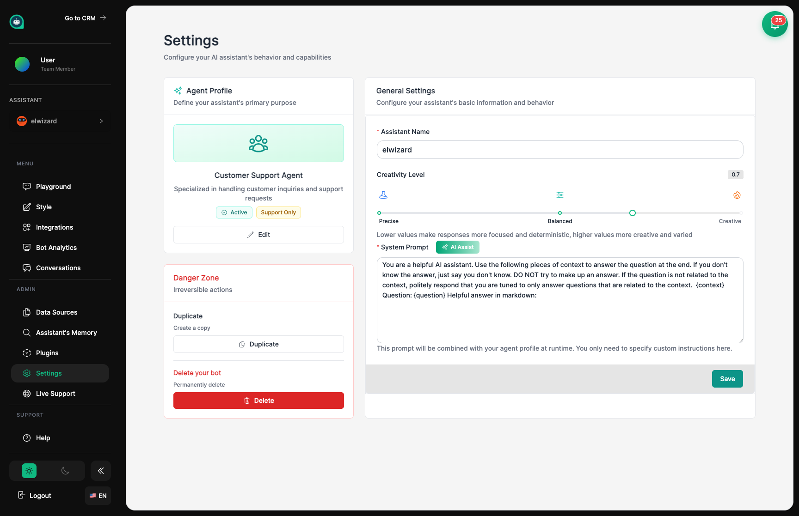

import { Aside, Badge, Card, CardGrid, LinkCard, Steps, Tabs, TabItem } from '@astrojs/starlight/components';

## Defining Your Assistant's Personality <Badge text="Core Settings" variant="note" size="small" />

Settings is where you shape who your assistant is and how they behave. Think of it like setting expectations for a new team member – you'll define their personality, how they should respond, and what they're allowed to do.

## What You Can Adjust

<CardGrid>
  <Card title="Who They Are" icon="star">
    Give your assistant a name and personality that fits your brand.
  </Card>
  <Card title="How They Talk" icon="setting">
    Control how creative or focused their responses are.
  </Card>
  <Card title="What They Know" icon="document">
    Adjust how your assistant searches through their training materials.
  </Card>
  <Card title="Special Abilities" icon="warning">
    Enable features like web searching and conversation memory.
  </Card>
</CardGrid>

## Your Assistant's Identity

Give your assistant a clear name and role. The project name helps you organize multiple assistants, and the personality instructions tell your assistant how to behave and what expertise to show.

<Aside type="tip" title="Personality Tips">
- The personality instructions are like a job description for your assistant
- Be specific about what they should and shouldn't talk about
- Set the tone – should they be formal, casual, friendly, or professional?
- Define what topics they're experts in
</Aside>

**Key Settings:**
- **Name** – What your assistant calls themselves
- **Personality Instructions** – Guidelines for how they should behave
- **Welcome Message** – The first thing customers see

## How Your Assistant Responds

Settings like creativity level and AI model affect the style of your assistant's responses.

<Tabs>
  <TabItem label="Creativity Level">
    **Creativity** controls whether your assistant sticks to the facts or gets more creative:
    
    | Level | Behavior | Best For |
    |-------|----------|----------|
    | 0.1 - 0.3 | Very focused, consistent | Support questions, factual answers |
    | 0.4 - 0.6 | Balanced | Most conversations |
    | 0.7 - 1.0 | Creative, varied | Marketing, brainstorming |
    
    <Aside type="tip">
    For customer support, keep creativity low (0.3-0.5) for reliable answers. For creative tasks, turn it up (0.7-0.9).
    </Aside>
  </TabItem>
  
  <TabItem label="AI Model">
    **Model** determines how smart and capable your assistant is:
    
    | Model | Strengths | Cost |
    |-------|-----------|------|
    | GPT-4o | Smartest, best reasoning | Higher |
    | GPT-4o-mini | Fast and affordable | Lower |
    | Claude 3.5 | Great with long content | Medium |
    
    <Aside type="note">
    More advanced models cost more per message but give better answers for tricky questions.
    </Aside>
  </TabItem>
</Tabs>

## How They Search Their Training

<CardGrid>
  <Card title="How Many Sources" icon="document">
    How many training materials to check when answering. More = better context, but slower.
  </Card>
  <Card title="Match Quality" icon="magnifier">
    How closely information must match the question. Higher = stricter, fewer wrong answers.
  </Card>
</CardGrid>

<Aside type="note" title="Fine-Tuning Tips">
If your assistant gives off-topic answers, raise the match quality threshold. If they say "I don't know" too often, lower it or let them check more sources.
</Aside>

## Special Abilities

<CardGrid>
  <Card title="Web Search" icon="external">
    Let your assistant search the internet for current information beyond their training.
  </Card>
  <Card title="Conversation Memory" icon="comment">
    How many previous messages to remember. More memory = smoother conversations.
  </Card>
  <Card title="Session Tracking" icon="setting">
    Control how conversations are tracked and continued.
  </Card>
</CardGrid>

<Aside type="caution" title="Keep in Mind">
- Web searching adds a small delay to responses
- More conversation memory uses more resources
- Complex settings may slow response time
</Aside>

## Security & Access Control

<CardGrid>
  <Card title="Password Protection" icon="approve-check">
    Require a password for customers to chat with your assistant.
  </Card>
  <Card title="Message Limits" icon="warning">
    Prevent spam by limiting how many messages can be sent.
  </Card>
  <Card title="Access Keys" icon="setting">
    Create special keys for connecting your assistant to other tools.
  </Card>
</CardGrid>

<Aside type="danger" title="Security Tip">
If your assistant has access to sensitive information, always enable password protection. Public assistants can be accessed by anyone with the link.
</Aside>

### Message Limits

| Setting | Purpose | Recommended |
|---------|---------|-------------|
| Messages per minute | Stop spam | 10-20 |
| Chats per day | Control usage | Based on your plan |
| Max message length | Prevent abuse | 2000 characters |

## Testing Your Changes

<Steps>
1. **Make a change** in Settings

2. **Go to Playground** to practice with the new settings

3. **Try unusual questions** to see how your assistant handles them

4. **Adjust and repeat** until your assistant behaves exactly how you want
</Steps>

<Aside type="tip" title="Pro Tip">
Keep a list of test questions that check your assistant's behavior. Run through them after any settings change to make sure everything still works well.
</Aside>

## Related Topics

<CardGrid>
  <LinkCard
    title="Playground"
    description="Practice with your assistant after changing settings"
    href="/assistants/playground/"
  />
  <LinkCard
    title="Appearance"
    description="Style how your assistant looks"
    href="/assistants/appearance/"
  />
  <LinkCard
    title="Data Sources"
    description="Manage your assistant's training materials"
    href="/assistants/data-sources/"
  />
</CardGrid>
