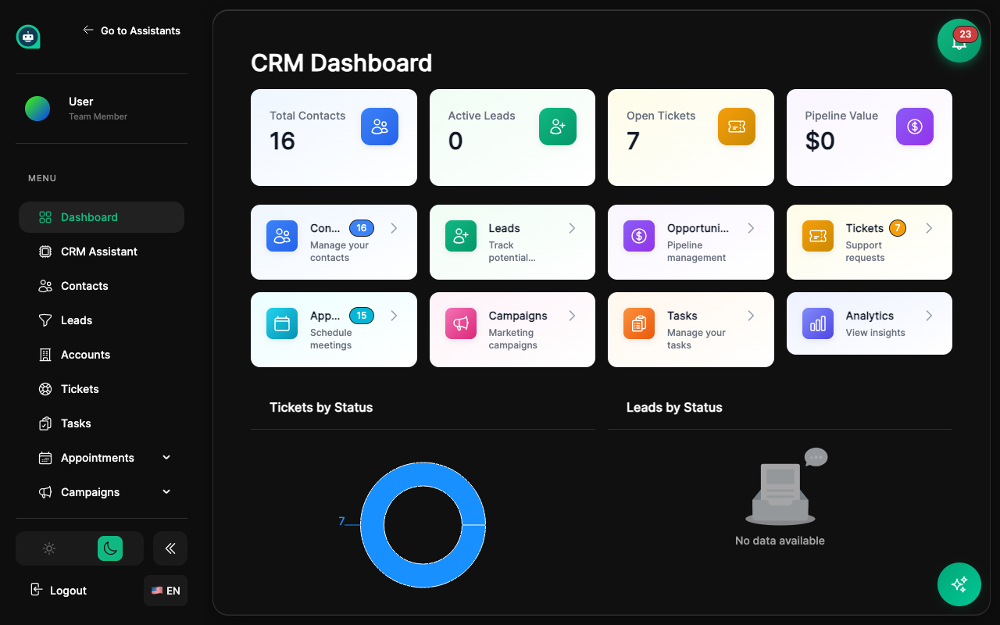

import { Aside, Badge, Card, CardGrid, LinkCard, Steps, Tabs, TabItem } from '@astrojs/starlight/components';

MyGPTAssistants includes a full-featured CRM system that integrates seamlessly with your AI assistants. <Badge text="AI-Powered" variant="success" size="small" />

## What is the CRM?

The CRM (Customer Relationship Management) system helps you manage every aspect of your customer relationships — from first contact through appointments, support tickets, and deal closure:

<CardGrid>
  <Card title="Track Contacts & Leads" icon="add-document">
    Everyone who interacts with your business, automatically captured. Leads qualify through the pipeline into full contacts.
  </Card>
  <Card title="Appointments" icon="document">
    AI-assisted scheduling with calendar sync, availability rules, and branded confirmation emails.
  </Card>
  <Card title="Tasks" icon="approve-check">
    Assign and track follow-up tasks. Bots can create tasks automatically during conversations.
  </Card>
  <Card title="Tickets" icon="warning">
    Support ticket management created automatically from escalated conversations.
  </Card>
  <Card title="Campaigns & Sequences" icon="rocket">
    Email and message campaigns with multi-step drip sequences for nurturing leads.
  </Card>
  <Card title="Live Escalation" icon="phone">
    AI detects when a customer needs human help and seamlessly transfers the conversation.
  </Card>
  <Card title="Manage Pipelines" icon="bars">
    Track deals and opportunities through sales stages with values and probability.
  </Card>
  <Card title="Create Segments" icon="group">
    Group contacts dynamically by behavior or attributes for targeted outreach.
  </Card>
  <Card title="Reports & Analytics" icon="graph">
    Understand your customer interactions across contacts, tickets, campaigns, and leads.
  </Card>
</CardGrid>

## Core Components

<CardGrid>
  <Card title="Contacts" icon="group">
    **People who interact with your business**
    
    Automatically created from chat conversations with full profile and communication history.
    
    [Learn more →](/crm/contacts/)
  </Card>
  <Card title="Leads" icon="rocket">
    **Prospects being qualified**
    
    Leads captured by your AI assistant, tracked through your pipeline until they convert to contacts.
    
    [Learn more →](/crm/leads/)
  </Card>
  <Card title="Appointments" icon="document">
    **AI-assisted scheduling**
    
    Let your assistant book meetings with customers, sync with Google Calendar, and send confirmation emails.
    
    [Learn more →](/crm/appointments/)
  </Card>
  <Card title="Tasks" icon="approve-check">
    **Follow-up action tracking**
    
    Assign tasks to team members. Bots can auto-create tasks from conversation outcomes.
    
    [Learn more →](/crm/tasks/)
  </Card>
  <Card title="Tickets" icon="warning">
    **Support issue management**
    
    Tickets created automatically from escalated conversations. Track status through resolution.
    
    [Learn more →](/crm/tickets/)
  </Card>
  <Card title="Live Escalation" icon="phone">
    **Human agent handoff**
    
    AI monitors sentiment and escalates to human agents when customers need real help.
    
    [Learn more →](/crm/live-escalation/)
  </Card>
  <Card title="Campaigns" icon="email">
    **Email & message campaigns**
    
    Send targeted messages and multi-step drip sequences to segments of your contacts.
    
    [Learn more →](/crm/campaigns/)
  </Card>
  <Card title="Pipelines" icon="bars">
    **Track deals and opportunities**
    
    Custom stages with deal values, probability, and win/loss tracking.
    
    [Learn more →](/crm/pipelines/)
  </Card>
  <Card title="Segments" icon="bars">
    **Dynamic groups of contacts**
    
    Rule-based filtering and real-time updates for targeted campaigns.
    
    [Learn more →](/crm/segments/)
  </Card>
  <Card title="Reports" icon="graph">
    **Understand your data**
    
    Contact analytics, pipeline performance, ticket resolution, and conversation insights.
    
    [Learn more →](/crm/reports/)
  </Card>
</CardGrid>

## Integration with AI Assistants <Badge text="AI-Powered" variant="success" size="small" />

<Aside type="tip" title="AI + CRM Integration">
- **Automatic contact creation** - New chat visitors become contacts
- **Conversation history** - All chats linked to contact profiles
- **Smart routing** - Route conversations based on CRM data
- **Personalization** - Use CRM data to personalize bot responses
</Aside>

<Tabs>
  <TabItem label="Auto Contact Creation">
    When a visitor chats with your bot, a contact record is automatically created with:
    
    | Data Captured | Source |
    |--------------|--------|
    | Name | Bot conversation or form |
    | Email | User-provided or integration |
    | Platform | Website, Instagram, WhatsApp, etc. |
    | First Message | Conversation opener |
    | Timestamp | When conversation started |
  </TabItem>
  <TabItem label="Smart Routing">
    Route conversations based on CRM data:
    
    | Condition | Action |
    |-----------|--------|
    | VIP Contact | Priority queue |
    | Open Deal | Route to assigned rep |
    | New Contact | Welcome workflow |
    | Support Segment | Technical team |
  </TabItem>
</Tabs>

## Getting Started

<Steps>
1. **Navigate to CRM**
   
   Access the CRM section from your main dashboard sidebar.

2. **Import or auto-create contacts**
   
   Import existing contacts via CSV or let them be created automatically from conversations.

3. **Set up pipelines**
   
   Create pipeline stages that match your sales process (Lead → Qualified → Proposal → Closed).

4. **Create segments**
   
   Organize contacts into groups based on shared attributes or behaviors.

5. **Build workflows**
   
   Automate repetitive tasks like follow-ups, assignments, and notifications.
</Steps>

## CRM Features Overview

<Tabs>
  <TabItem label="Sales Features">
    | Feature | Description |
    |---------|-------------|
    | **Deal Tracking** | Monitor opportunities through stages |
    | **Pipeline Views** | Kanban and list views |
    | **Win/Loss Analysis** | Track conversion rates |
    | **Revenue Forecasting** | Projected deal values |
  </TabItem>
  <TabItem label="Marketing Features">
    | Feature | Description |
    |---------|-------------|
    | **Contact Segmentation** | Target specific groups |
    | **Campaign Tracking** | Measure engagement |
    | **Lead Scoring** | Prioritize hot leads |
    | **Automated Nurturing** | Multi-step sequences |
  </TabItem>
  <TabItem label="Service Features">
    | Feature | Description |
    |---------|-------------|
    | **Conversation History** | Full chat records |
    | **Ticket Management** | Track support issues |
    | **SLA Tracking** | Response time monitoring |
    | **Satisfaction Scores** | Customer feedback |
  </TabItem>
</Tabs>

<Aside type="note" title="Pro Tip">
Start with Contacts and Conversations before setting up complex workflows. Understanding your data flow is key to effective automation.
</Aside>

## Related Topics

<CardGrid>
  <LinkCard title="Contacts" description="Managing customer records" href="/crm/contacts/" />
  <LinkCard title="Leads" description="Qualify and convert prospects" href="/crm/leads/" />
  <LinkCard title="Appointments" description="AI-powered scheduling" href="/crm/appointments/" />
  <LinkCard title="Tasks" description="Follow-up task management" href="/crm/tasks/" />
  <LinkCard title="Tickets" description="Support ticket management" href="/crm/tickets/" />
  <LinkCard title="Live Escalation" description="Human agent handoff" href="/crm/live-escalation/" />
  <LinkCard title="Campaigns" description="Email and message campaigns" href="/crm/campaigns/" />
  <LinkCard title="Segments" description="Grouping contacts dynamically" href="/crm/segments/" />
  <LinkCard title="Pipelines" description="Sales deal tracking" href="/crm/pipelines/" />
  <LinkCard title="Reports" description="Business analytics" href="/crm/reports/" />
</CardGrid>
