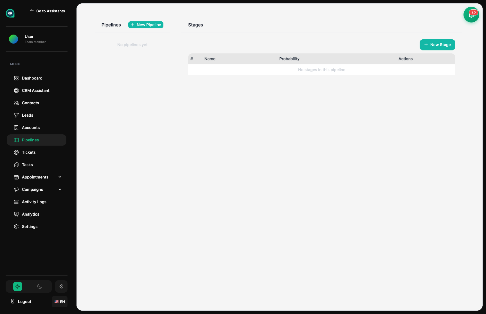
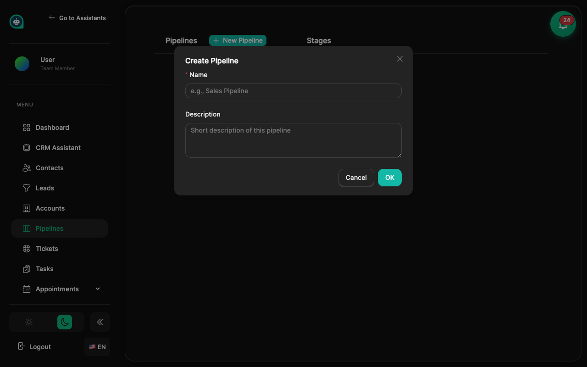
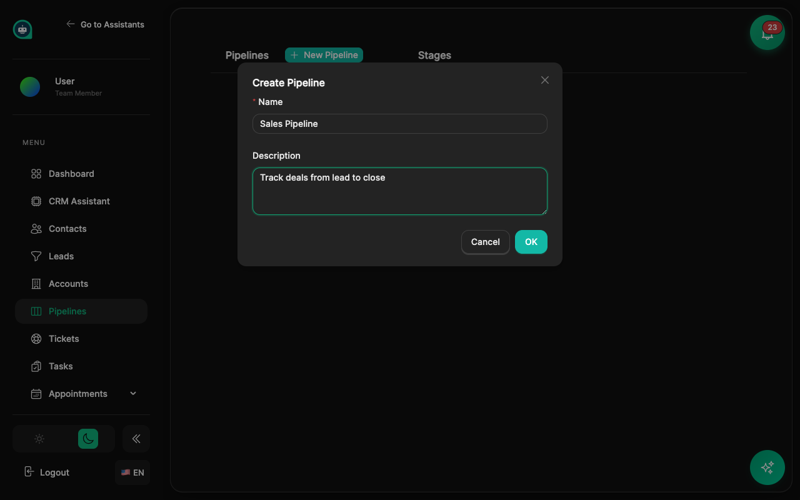
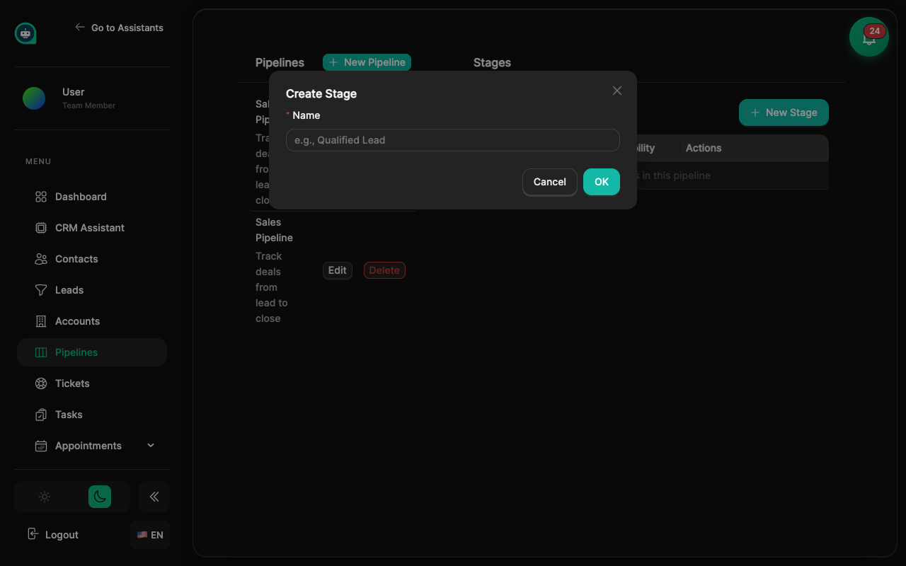

import { Aside, Badge, Card, CardGrid, LinkCard, Steps, Tabs, TabItem } from '@astrojs/starlight/components';

Pipelines help you organize and track your sales process by defining sequential stages that opportunities move through. <Badge text="Sales" variant="note" size="small" />

## What is a Pipeline?

A pipeline is a structured workflow representing your sales process. Each pipeline contains ordered stages that define the journey from initial lead to closed deal.

<CardGrid>
  <Card title="Multiple Pipelines" icon="list-format">
    Create separate pipelines for different sales processes (e.g., B2B, B2C, Enterprise).
  </Card>
  <Card title="Custom Stages" icon="setting">
    Define stages that match your unique sales workflow.
  </Card>
  <Card title="Stage Reordering" icon="random">
    Easily reorder stages using up/down controls.
  </Card>
  <Card title="Team Scoped" icon="group">
    Each team has its own isolated pipelines.
  </Card>
</CardGrid>

## Creating a Pipeline

<Steps>
1. **Navigate to Pipelines**
   
   Go to **CRM** → **Pipelines** from the sidebar navigation.
   
   

2. **Click New Pipeline**
   
   Click the **+ New Pipeline** button in the left panel.
   
   

3. **Enter Pipeline Details**
   
   - **Name**: A clear, descriptive name (e.g., "Sales Pipeline", "Enterprise Deals")
   - **Description**: Optional context about when to use this pipeline
   
   

4. **Save**
   
   Click **OK** to create the pipeline. It will appear in the pipelines list.
</Steps>

## Managing Stages

Once you've created a pipeline, you can add stages to define your sales workflow.

### Adding Stages

<Steps>
1. **Select a Pipeline**
   
   Click on a pipeline in the left panel to view its stages.

2. **Click New Stage**
   
   Click the **+ New Stage** button above the stages table.
   
   

3. **Enter Stage Name**
   
   Give the stage a clear, action-oriented name (e.g., "Lead", "Qualified", "Proposal").

4. **Save**
   
   Click **OK** to add the stage. New stages are added at the end of the list.
</Steps>

### Reordering Stages

Use the arrow buttons in the **Actions** column to move stages up or down in the sequence:
- **↑ (Up arrow)**: Move stage earlier in the pipeline
- **↓ (Down arrow)**: Move stage later in the pipeline

<Aside type="tip" title="Stage Order Best Practice">
Order stages to reflect the natural progression of your sales process, from initial contact to final outcome.
</Aside>

## Pipeline Stages

<Tabs>
  <TabItem label="Example Stages">
    | # | Stage | Description |
    |---|-------|-------------|
    | 1 | **Lead** | Initial contact, needs qualification |
    | 2 | **Qualified** | Confirmed fit and interest |
    | 3 | **Proposal** | Sent pricing or proposal |
    | 4 | **Closed Won** | Deal completed successfully |
  </TabItem>
  <TabItem label="Stage Properties">
    | Property | Description |
    |----------|-------------|
    | **Name** | Display name shown in lists and tables |
    | **Order** | Position in the pipeline sequence (auto-managed) |
    | **Probability** | Optional likelihood of closing at this stage |
  </TabItem>
</Tabs>

## Editing and Deleting

### Edit a Pipeline or Stage
Click the **Edit** button next to any pipeline or stage to modify its details.

### Delete a Pipeline
<Aside type="caution">
Deleting a pipeline will remove all its stages. This action cannot be undone.
</Aside>

Click **Delete** next to a pipeline and confirm the action.

### Delete a Stage
Click **Delete** next to a stage to remove it from the pipeline.

## Mobile Support

The Pipelines page is fully responsive:
- On mobile devices, the pipelines list appears in a slide-out drawer
- Tap the menu icon to access the pipelines list
- All stage management features work on mobile

## Best Practices

<Aside type="tip" title="Pipeline Tips">
- **Keep stages simple** — 4-6 stages typically works best
- **Use clear names** — Stage names should indicate the action or status
- **Order logically** — Stages should flow naturally from start to finish
- **Separate pipelines** — Create different pipelines for distinct sales processes
</Aside>

## Pipeline Examples

| Pipeline | Example Stages | Use Case |
|----------|----------------|----------|
| **Sales** | Lead → Qualified → Proposal → Closed Won | Standard B2B sales |
| **Enterprise** | Discovery → Demo → POC → Contract | High-touch deals |
| **Support** | New → In Progress → Resolved | Support ticket tracking |
| **Onboarding** | Signed → Setup → Training → Active | Customer onboarding |

## Related Topics

<CardGrid>
  <LinkCard
    title="Contacts"
    description="Manage customer and lead contacts"
    href="/crm/contacts/"
  />
  <LinkCard
    title="Workflows"
    description="Automate actions based on events"
    href="/crm/workflows/"
  />
  <LinkCard
    title="Reports"
    description="View CRM analytics and insights"
    href="/crm/reports/"
  />
  <LinkCard
    title="CRM Overview"
    description="Full CRM feature overview"
    href="/crm/overview/"
  />
</CardGrid>
