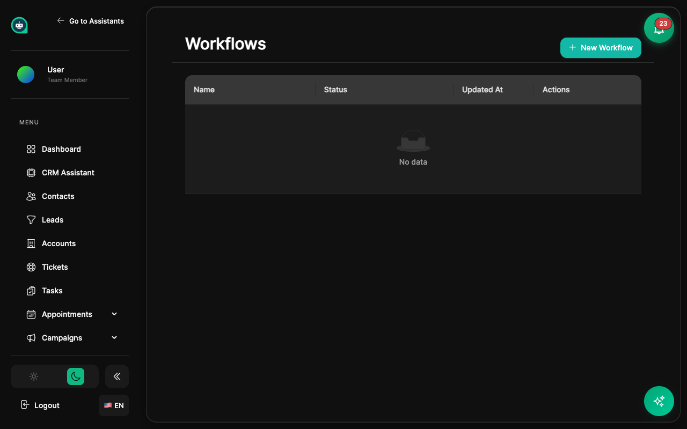

import { Aside, Badge, Card, CardGrid, LinkCard, Steps, Tabs, TabItem } from '@astrojs/starlight/components';

Workflows automate repetitive tasks by triggering actions based on events. <Badge text="Automation" variant="success" size="small" />

## How Workflows Work

<CardGrid>
  <Card title="Trigger" icon="rocket">
    **Event that starts the workflow**
    
    Contact created, message received, schedule reached.
  </Card>
  <Card title="Conditions" icon="setting">
    **Rules that must be true**
    
    Filter when workflow runs based on data.
  </Card>
  <Card title="Actions" icon="random">
    **What happens when triggered**
    
    Send emails, update records, notify team.
  </Card>
</CardGrid>

## Triggers

<Tabs>
  <TabItem label="Contact Triggers">
    | Trigger | Description |
    |---------|-------------|
    | **Contact created** | New contact added to CRM |
    | **Contact updated** | Any field changes |
    | **Added to segment** | Contact matches segment rules |
    | **Tag added/removed** | Tag changes on contact |
  </TabItem>
  <TabItem label="Conversation Triggers">
    | Trigger | Description |
    |---------|-------------|
    | **Conversation started** | New chat begins |
    | **Conversation ended** | Chat session closes |
    | **Message received** | Any incoming message |
    | **Escalation requested** | User asks for human |
    | **Sentiment detected** | Positive/negative detected |
  </TabItem>
  <TabItem label="CRM Triggers">
    | Trigger | Description |
    |---------|-------------|
    | **Lead created** | New lead in pipeline |
    | **Lead status changed** | Stage progression |
    | **Ticket created** | New support ticket |
    | **Appointment booked** | Meeting scheduled |
    | **Appointment cancelled** | Meeting cancelled |
  </TabItem>
  <TabItem label="Time Triggers">
    | Trigger | Description |
    |---------|-------------|
    | **Scheduled (cron)** | Runs on schedule |
    | **Delay after event** | Wait then execute |
    | **Date field reached** | When date arrives |
  </TabItem>
</Tabs>

## Conditions

<CardGrid>
  <Card title="Contact Properties" icon="group">
    Filter by name, email, tags, custom fields.
  </Card>
  <Card title="Conversation Data" icon="comment">
    Based on message content, platform, sentiment.
  </Card>
  <Card title="Time-Based" icon="document">
    Business hours, days since event, dates.
  </Card>
  <Card title="Custom Logic" icon="setting">
    AND/OR combinations for complex scenarios.
  </Card>
</CardGrid>

<Aside type="tip" title="Condition Strategy">
- **Use conditions** to prevent workflows from running unnecessarily
- **Test conditions** with sample data before activating
- **Combine AND/OR logic** for complex scenarios
</Aside>

## Actions

<Tabs>
  <TabItem label="Contact Actions">
    <CardGrid>
      <Card title="Update Fields" icon="pencil">
        Change any contact property or custom field.
      </Card>
      <Card title="Add/Remove Tags" icon="add-document">
        Manage contact organization and targeting.
      </Card>
      <Card title="Add to Segment" icon="bars">
        Place contact in specific segment.
      </Card>
      <Card title="Assign to User" icon="group">
        Route contact to team member.
      </Card>
    </CardGrid>
  </TabItem>
  <TabItem label="Communication Actions">
    <CardGrid>
      <Card title="Send Email" icon="email">
        Automated email from templates.
      </Card>
      <Card title="Send SMS" icon="comment">
        Text message notifications.
      </Card>
      <Card title="Internal Notification" icon="warning">
        Alert team members.
      </Card>
      <Card title="Create Task" icon="add-document">
        Assign follow-up tasks.
      </Card>
    </CardGrid>
  </TabItem>
  <TabItem label="CRM Actions">
    <CardGrid>
      <Card title="Create Lead" icon="rocket">
        Add new lead to pipeline.
      </Card>
      <Card title="Update Lead Status" icon="pencil">
        Move lead through stages.
      </Card>
      <Card title="Create Ticket" icon="document">
        Open support ticket.
      </Card>
      <Card title="Assign Ticket" icon="group">
        Route to support team.
      </Card>
    </CardGrid>
  </TabItem>
  <TabItem label="Integration Actions">
    <CardGrid>
      <Card title="Call Webhook" icon="external">
        Send data to external URLs.
      </Card>
      <Card title="Update External CRM" icon="random">
        Sync with other systems.
      </Card>
      <Card title="Trigger Zapier" icon="setting">
        Connect to 5,000+ apps.
      </Card>
    </CardGrid>
  </TabItem>
  <TabItem label="Flow Actions">
    <CardGrid>
      <Card title="Wait/Delay" icon="document">
        Pause before next action.
      </Card>
      <Card title="Conditional Branch" icon="random">
        If/then logic paths.
      </Card>
      <Card title="End Workflow" icon="close">
        Stop execution.
      </Card>
    </CardGrid>
  </TabItem>
</Tabs>

## Creating a Workflow

<Steps>
1. **Navigate to Workflows**
   
   Go to **CRM** → **Workflows** from the sidebar.

2. **Click Create Workflow**
   
   Start a new workflow configuration.

3. **Select a trigger**
   
   Choose what event starts the workflow.

4. **Add conditions**
   
   Define when the workflow should run (optional).

5. **Add actions**
   
   Configure what happens when triggered.

6. **Test the workflow**
   
   Use test mode with sample data.

7. **Activate**
   
   Turn on the workflow for production use.
</Steps>

<Aside type="caution" title="Testing Warning">
Always test workflows in a staging environment or with test data before activating. Automated workflows can affect many contacts quickly if misconfigured.
</Aside>

<Aside type="tip" title="Workflow Best Practices">
- **Start simple** - Add complexity gradually
- **Use delays** - Avoid overwhelming contacts with too many messages
- **Test thoroughly** - Verify all paths before activating
- **Monitor performance** - Track execution and adjust as needed
</Aside>

## Example Workflows

<Tabs>
  <TabItem label="Welcome Series">
    **Trigger**: Contact created
    
    <Steps>
    1. Send welcome email immediately
    2. Wait 2 days
    3. Send follow-up with resources
    4. Wait 3 days
    5. Send engagement check-in
    </Steps>
  </TabItem>
  <TabItem label="Lead Nurturing">
    **Trigger**: Lead score > 50
    
    <Steps>
    1. Add to "Hot Leads" segment
    2. Notify sales team
    3. Create follow-up task
    4. Send personalized email
    </Steps>
  </TabItem>
  <TabItem label="Escalation Handler">
    **Trigger**: Escalation requested
    
    <Steps>
    1. Create support ticket
    2. Assign to support team
    3. Send internal notification
    4. Send customer acknowledgment
    </Steps>
  </TabItem>
</Tabs>

## Workflow Status

| Status | Description |
|--------|-------------|
| **<Badge text="Active" variant="success" size="small" />** | Running and processing triggers |
| **<Badge text="Paused" variant="caution" size="small" />** | Temporarily disabled |
| **<Badge text="Draft" variant="default" size="small" />** | Not yet activated |
| **<Badge text="Error" variant="danger" size="small" />** | Has execution failures |

## Related Topics

<CardGrid>
  <LinkCard
    title="Segments"
    description="Target workflows by segment"
    href="/crm/segments/"
  />
  <LinkCard
    title="Contacts"
    description="Understand contact data for conditions"
    href="/crm/contacts/"
  />
  <LinkCard
    title="Reports"
    description="Track workflow performance"
    href="/crm/reports/"
  />
  <LinkCard
    title="CRM Overview"
    description="Full CRM feature overview"
    href="/crm/overview/"
  />
</CardGrid>
