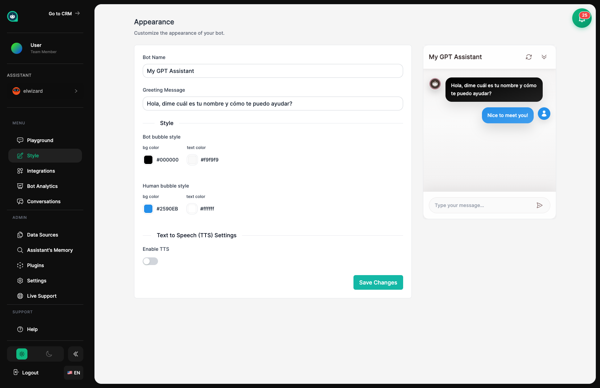

import { Aside, Badge, Card, CardGrid, LinkCard, Steps, Tabs, TabItem } from '@astrojs/starlight/components';

## Dale a Tu Asistente un Look de Empresa <Badge text="Branding" variant="tip" size="small" />

La sección de Apariencia es donde personalizas cómo se ve tu asistente cuando chatea con clientes. Piensa en ello como elegir un uniforme y una etiqueta de nombre para un nuevo miembro del equipo – quieres que se vea profesional y que encaje con tu marca.

## Qué Puedes Personalizar

<CardGrid>
  <Card title="Colores y Tema" icon="pencil">
    Elige colores para las burbujas de chat y fondos que coincidan con tu marca.
  </Card>
  <Card title="Nombre y Saludo" icon="star">
    Elige cómo se llama tu asistente y cómo se presenta a los visitantes.
  </Card>
  <Card title="Posición" icon="external">
    Decide dónde aparece el botón de chat en tu sitio web.
  </Card>
  <Card title="Voz" icon="comment">
    Deja que tu asistente hable las respuestas en voz alta con texto a voz.
  </Card>
</CardGrid>

## Lo Básico: Nombre y Saludo

Comienza dando a tu asistente un nombre y escribiendo su mensaje de saludo – lo primero que los clientes ven cuando abren el chat. Esta es la primera impresión de tu asistente, ¡así que hazla acogedora y clara!

<Aside type="tip" title="Consejos de Nombre y Saludo">
- Mantén el nombre corto y amigable (como "Alex" o "Equipo de Soporte")
- El saludo debe explicar en qué puede ayudar tu asistente
- Usa un tono amigable y conversacional que coincida con tu marca
- Piensa en tu audiencia – formal para clientes empresariales, casual para clientes cotidianos
</Aside>

### Ejemplos de Saludos

<Tabs>
  <TabItem label="Amigable">
    > 👋 ¡Hola! Estoy aquí para ayudarte con cualquier pregunta sobre nuestros productos. ¿En qué puedo ayudarte hoy?
    
    **Mejor para:** Marcas de consumo, comercio electrónico, negocios casuales
  </TabItem>
  <TabItem label="Profesional">
    > Bienvenido a Soporte de [Empresa]. Puedo asistirte con información de productos, preguntas técnicas y consultas de cuenta. ¿Cómo puedo ayudarte?
    
    **Mejor para:** Empresas B2B, corporativas, servicios profesionales
  </TabItem>
  <TabItem label="Enfocado">
    > ¡Hola! Soy tu especialista en productos. Pregúntame cualquier cosa sobre funciones, precios o cómo empezar.
    
    **Mejor para:** Productos SaaS, soporte específico de productos
  </TabItem>
</Tabs>

## Colores: Vistiéndose para el Trabajo

Elige colores que coincidan con tu sitio web y marca. ¡Tu asistente debe verse como si perteneciera a tu equipo!

<CardGrid>
  <Card title="Mensajes del Asistente" icon="comment">
    Usa aquí el color de tu marca. Solo asegúrate de que el texto sea fácil de leer.
  </Card>
  <Card title="Mensajes del Cliente" icon="pencil">
    Mantén estos neutrales (gris o blanco) para que se destaquen de las respuestas de tu asistente.
  </Card>
  <Card title="Fondo" icon="document">
    Los fondos claros generalmente funcionan mejor para facilitar la lectura.
  </Card>
</CardGrid>

<Aside type="tip" title="Consejos de Color">
- Asegúrate de que el texto sea fácil de leer contra los colores de fondo
- Prueba tus colores tanto en fondos claros como oscuros del sitio web
- Previsualiza los cambios antes de guardar para ver cómo queda todo junto
- Recuerda a las personas con daltonismo – no dependas solo del color
</Aside>

### Ejemplos de Colores

| Estilo | Color Asistente | Color Cliente | Fondo | Funciona Para |
|--------|-----------------|---------------|-------|---------------|
| Profesional | Azul Marino | Gris Claro | Blanco | Corporativo, B2B |
| Amigable | Azul Brillante | Gris Claro | Blanco Hueso | Apps de consumo |
| Llamativo | Rojo de Marca | Gris Oscuro | Blanco | Sitios de marketing |
| Minimalista | Gris Oscuro | Gris Claro | Blanco | Look limpio y moderno |

## Véalo Antes de Guardar

El panel de vista previa muestra exactamente cómo se verá tu widget de chat para los clientes. Cualquier cambio que hagas aparece instantáneamente, para que puedas experimentar hasta que se vea perfecto.

<Steps>
1. **Haz un cambio** en el panel de personalización

2. **Revisa la vista previa** en el lado derecho

3. **Prueba diferentes fondos** usando las opciones de vista previa

4. **Guarda** cuando estés contento con cómo se ve
</Steps>

## Funciones de Voz <Badge text="Opcional" variant="note" size="small" />

¿Quieres que tu asistente hable sus respuestas en voz alta? Habilita texto a voz y elige una voz que encaje con tu marca.

<CardGrid>
  <Card title="Voces de OpenAI" icon="star">
    Voces de alta calidad y sonido natural con múltiples opciones.
  </Card>
  <Card title="ElevenLabs" icon="star">
    Voces premium con rango emocional y opciones de voz personalizadas.
  </Card>
  <Card title="Voces del Navegador" icon="setting">
    Voces integradas del navegador. Gratis pero suenan más robóticas.
  </Card>
</CardGrid>

<Aside type="note" title="Consideraciones de Voz">
- La voz añade un pequeño retraso a las respuestas
- Los proveedores de voz premium pueden costar extra
- Prueba la voz en dispositivos móviles – los altavoces varían
</Aside>

## ¿Dónde Debe Ir el Botón de Chat?

<Tabs>
  <TabItem label="Abajo Derecha">
    **El lugar estándar.** La mayoría de los visitantes esperan encontrar los widgets de chat aquí. 
    
    ✅ Recomendado para la mayoría de sitios web
  </TabItem>
  <TabItem label="Abajo Izquierda">
    Usa esto si abajo-derecha entra en conflicto con otros elementos en tu sitio.
    
    ⚠️ Menos común, algunos visitantes podrían no verlo
  </TabItem>
</Tabs>

## Haciéndolo Lucir Profesional

<Aside type="tip" title="Consejos de Diseño">
1. **Mantén consistencia** – Que coincida con el aspecto general de tu sitio web
2. **Mantenlo legible** – Asegúrate de que el texto sea fácil de leer con buen contraste
3. **Piensa primero en móvil** – La mayoría de los visitantes estarán en teléfonos, así que prueba ahí primero
4. **Mantenlo simple** – Un aspecto limpio es más profesional que un diseño excesivo
5. **Obtén retroalimentación** – Pregunta a clientes reales qué piensan antes de finalizar
</Aside>

## Temas Relacionados

<CardGrid>
  <LinkCard
    title="Insertar"
    description="Pon a tu asistente estilizado en tu sitio web"
    href="/es/assistants/embed/"
  />
  <LinkCard
    title="Área de Pruebas"
    description="Mira cómo se ve tu asistente mientras practicas"
    href="/es/assistants/playground/"
  />
  <LinkCard
    title="Configuración"
    description="Define la personalidad de tu asistente"
    href="/es/assistants/settings/"
  />
</CardGrid>
