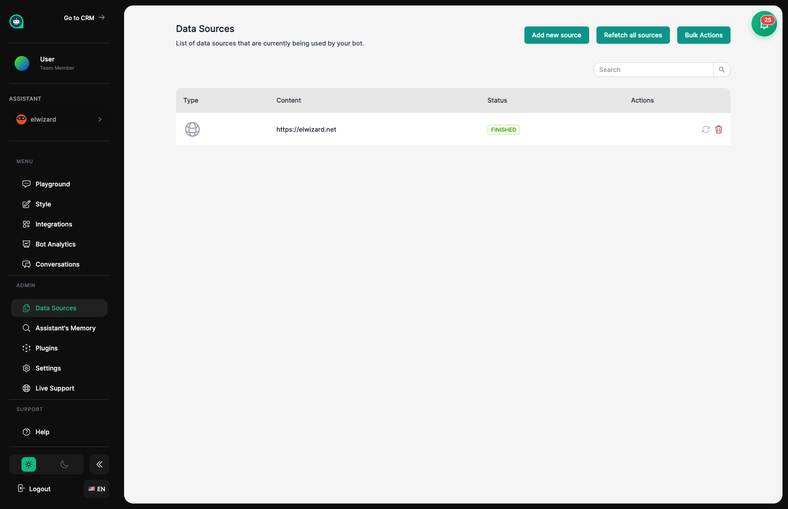
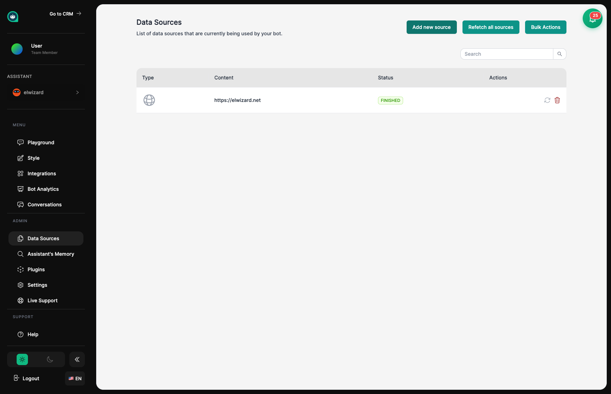

import { Aside, Badge, Card, CardGrid, LinkCard, Steps, Tabs, TabItem, FileTree } from '@astrojs/starlight/components';

## Entrenando a Tu Asistente <Badge text="Función Principal" variant="note" size="small" />

Al igual que incorporar a un nuevo empleado, necesitas compartir materiales de entrenamiento con tu asistente. Cuanta más información relevante proporciones, mejor ayudará a tus clientes. Piensa en las Fuentes de Datos como la carpeta de entrenamiento de tu asistente – todo lo que necesita saber sobre tu negocio va aquí.

## Añadiendo una Nueva Fuente de Datos

Haz clic en "Añadir nueva fuente" para abrir el modal de selección de fuentes de datos. Elige entre múltiples tipos de fuentes incluyendo páginas web, texto, archivos, rastreadores web, repositorios de GitHub, videos de YouTube, APIs REST y sitemaps.

## Tipos de Materiales de Entrenamiento

<Tabs syncKey="datasource">
  <TabItem label="Documentos" icon="document">
    **Comparte archivos** como PDFs, documentos de Word y archivos de texto. Perfecto para:
    - Manuales de empleados y guías
    - Manuales de productos y especificaciones
    - Políticas y procedimientos de la empresa
    - Hojas de preguntas frecuentes y materiales de referencia
    
    **Formatos aceptados:** PDF, DOCX, DOC, TXT, MD
    
    <Aside type="tip" title="Mejor para Documentos">
    Los documentos funcionan muy bien para materiales oficiales que no cambian frecuentemente – como tu manual de productos o handbook de la empresa.
    </Aside>
  </TabItem>
  
  <TabItem label="Sitios Web" icon="external">
    **Apunta a tu sitio web** y deja que tu asistente lea y aprenda de tus páginas. Excelente para:
    - Descripciones de productos y servicios
    - Centro de ayuda y artículos de soporte
    - Publicaciones del blog y noticias de la empresa
    - Información de contacto y sobre nosotros
    
    **Funciones:**
    - Elige cuántas páginas de profundidad leer
    - Establece un límite de páginas totales
    - Auto-actualización para mantener el conocimiento fresco
    
    <Aside type="tip" title="Consejos para Sitios Web">
    Comienza pequeño – haz que tu asistente lea solo 2-3 niveles de profundidad. Siempre puedes añadir más páginas después. Leer demasiadas páginas a la vez toma más tiempo y cuesta más.
    </Aside>
  </TabItem>
  
  <TabItem label="Texto" icon="pencil">
    **Escribe o pega información** directamente para actualizaciones rápidas. Perfecto para:
    - Preguntas y respuestas comunes
    - Puntos de conversación específicos que quieres que sepan
    - Correcciones o aclaraciones rápidas
    - Instrucciones o directrices especiales
    
    <Aside type="tip" title="Consejos de Texto Directo">
    Esto es como darle a tu asistente una nota rápida o memo. Úsalo para cosas específicas que quieres que digan, o respuestas a preguntas que no están cubiertas en otro lugar.
    </Aside>
  </TabItem>
  
  <TabItem label="Multimedia" icon="star">
    **Archivos de audio y video** que se transcriben automáticamente. Excelente para:
    - Videos de capacitación y tutoriales
    - Presentaciones grabadas y webinars
    - Grabaciones de reuniones con información importante
    - Demos de productos y guías paso a paso
    
    **Formatos aceptados:** MP3, MP4, WAV, M4A
    
    <Aside type="note">
    Tu asistente "escuchará" los archivos de audio y video y aprenderá de lo que se dice. Las grabaciones más largas toman más tiempo en procesar.
    </Aside>
  </TabItem>
</Tabs>

## Añadiendo Contenido de Sitio Web

<Steps>
1. **Comparte la dirección web**
   
   Pega la URL del sitio web que quieres que tu asistente estudie.

2. **Establece límites**
   
   Dile cuántas páginas leer (profundidad) y el número máximo de páginas en total.

3. **Inicia el proceso de aprendizaje**
   
   Haz clic en "Añadir Fuente" y tu asistente comenzará a leer y memorizar el contenido.

4. **Mantenlo actualizado (opcional)**
   
   Activa auto-sincronización para que tu asistente aprenda automáticamente cuando tu sitio web cambie.
</Steps>

<Aside type="caution" title="Cosas a Tener en Cuenta">
- Los sitios web grandes toman más tiempo para que tu asistente aprenda
- Más páginas significa más tiempo de procesamiento
- Algunas páginas pueden estar protegidas y no pueden leerse
- Las páginas con muchos elementos interactivos pueden no funcionar bien
</Aside>

## Organizando Materiales de Entrenamiento <Badge text="Consejo Pro" variant="tip" size="small" />

Mantén los materiales de entrenamiento de tu asistente organizados, como lo harías para un nuevo empleado:

<FileTree>
- Materiales de Entrenamiento/
  - **Productos/**
    - catalogo-productos.pdf
    - guia-precios.pdf
    - lista-funciones.txt
  - **Soporte/**
    - faq.txt
    - guia-solucion-problemas.pdf
    - https://ayuda.ejemplo.com
  - **Empresa/**
    - sobre-nosotros.txt
    - https://ejemplo.com/nosotros
  - **Políticas/**
    - terminos-servicio.pdf
    - politica-privacidad.pdf
</FileTree>

## Gestionando Lo Que Han Aprendido

<CardGrid>
  <Card title="Actualizar" icon="refresh">
    Actualiza el conocimiento de sitios web para obtener la información más reciente. Usa esto cuando tu sitio tenga contenido nuevo.
  </Card>
  <Card title="Eliminar" icon="close">
    Quita materiales obsoletos o incorrectos. Evita que tu asistente dé información vieja.
  </Card>
  <Card title="Ver Estado" icon="information">
    Mira si el entrenamiento está completo, en progreso o tuvo algún problema.
  </Card>
</CardGrid>

## Consejos para Mejor Entrenamiento

<Aside type="tip" title="Calidad Sobre Cantidad">
La información clara y bien organizada ayuda a tu asistente a aprender mejor que montones de contenido desordenado. Piensa en lo que un nuevo empleado realmente necesitaría:
- Información precisa y actual
- Contenido bien estructurado con secciones claras
- Sin información conflictiva o duplicada
</Aside>

<Steps>
1. **Usa nombres claros**
   
   Nombra los materiales descriptivamente como "FAQ de Productos" no "Documento 1"

2. **Agrupa contenido relacionado**
   
   Organiza por tema – es más fácil de gestionar y actualizar después

3. **Evita duplicados**
   
   Repetir la misma información puede confundir a tu asistente

4. **Prueba después del entrenamiento**
   
   Ve al Área de Pruebas y haz preguntas para asegurarte de que aprendió correctamente
</Steps>

## Preguntas Comunes

<Aside type="caution" title="Mi asistente no sabe algo que compartí">
- Verifica que el material cubra ese tema
- Asegúrate de que el entrenamiento terminó (verifica el estado)
- Intenta hacer la pregunta de una manera diferente
- La información podría estar muy enterrada en un documento
</Aside>

<Aside type="caution" title="Mi asistente está dando información desactualizada">
- Haz clic en "Actualizar" en las fuentes de sitio web para obtener el contenido más reciente
- Sube la versión más nueva de cualquier documento
- Elimina materiales viejos antes de añadir los actualizados
</Aside>

<Aside type="danger" title="El entrenamiento parece atascado (más de 24 horas)">
- Archivos muy grandes pueden tardar más tiempo
- Asegúrate de que el tipo de archivo sea compatible
- Intenta dividir archivos grandes en piezas más pequeñas
- Contacta a soporte si ha pasado demasiado tiempo
</Aside>

## Temas Relacionados

<CardGrid>
  <LinkCard
    title="Área de Pruebas"
    description="Entrevista a tu asistente después de añadir nuevos materiales de entrenamiento"
    href="/es/assistants/playground/"
  />
  <LinkCard
    title="Configuración"
    description="Ajusta cómo tu asistente busca en su conocimiento"
    href="/es/assistants/settings/"
  />
  <LinkCard
    title="Búsqueda"
    description="Verifica que tu asistente pueda encontrar las respuestas correctas"
    href="/es/assistants/search/"
  />
</CardGrid>
