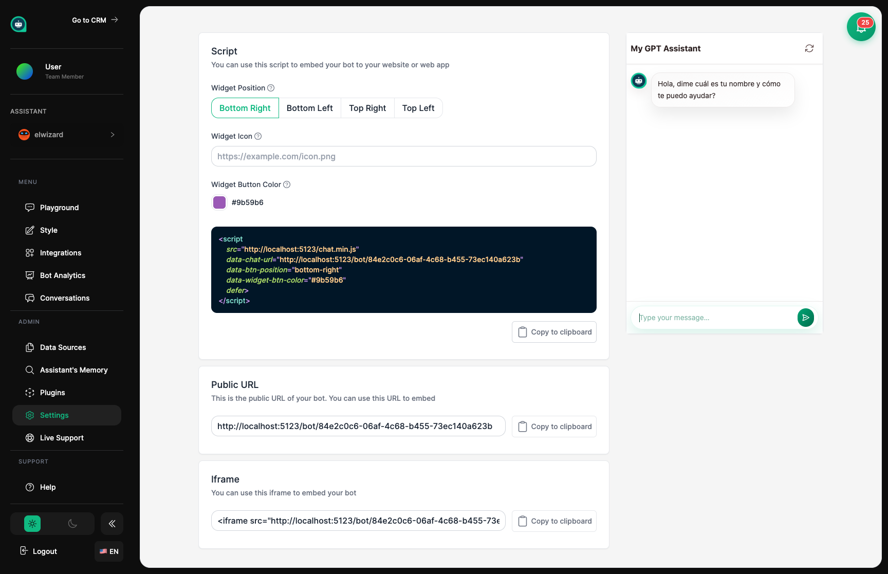

import { Aside, Badge, Card, CardGrid, LinkCard, Steps, Tabs, TabItem } from '@astrojs/starlight/components';

## Poniendo a Tu Asistente en Tu Sitio Web <Badge text="Lanzar" variant="success" size="small" />

La página de Insertar te da el código para añadir a tu asistente a tu sitio web. Una vez instalado, tu asistente aparece como una burbuja de chat amigable en la que los visitantes pueden hacer clic para iniciar una conversación – como tener a un miembro del equipo disponible 24/7.



## Obteniendo el Código

Copia el fragmento de código proporcionado y pégalo en tu sitio web. El código es único para tu asistente e incluye todo el estilo que has configurado en Apariencia.

<Aside type="tip" title="Dónde Poner el Código">
- Pega el código justo antes de la etiqueta de cierre `</body>` en tu sitio web
- No te preocupes – se carga en segundo plano y no ralentizará tu página
- Cuando cambies la apariencia o configuración, el widget se actualiza automáticamente – no necesitas tocar el código de nuevo
</Aside>

## Paso a Paso para Diferentes Sitios Web

<Tabs syncKey="platform">
  <TabItem label="HTML">
    ### Sitio Web Básico
    
    <Steps>
    1. **Copia el código** de la página de Insertar en tu panel de control
    
    2. **Abre tu archivo HTML** en un editor de código
    
    3. **Pega antes de `</body>`**
       ```html
       <!-- Widget de Chat de Tu Asistente -->
       <script
         src="https://app.mygptassistants.com/widget.js"
         data-bot-id="TU_BOT_ID"
         async
       ></script>
       </body>
       ```
    
    4. **Guarda y sube** tu sitio web
    </Steps>
  </TabItem>
  
  <TabItem label="WordPress">
    ### WordPress
    
    <Steps>
    1. **Instala un plugin de código** como "Insert Headers and Footers" o "WPCode"
    
    2. **Ve a la configuración del plugin** en tu admin de WordPress
    
    3. **Pega en la sección de footer**
       ```html
       <script
         src="https://app.mygptassistants.com/widget.js"
         data-bot-id="TU_BOT_ID"
         async
       ></script>
       ```
    
    4. **Guarda** tus cambios
    </Steps>
    
    <Aside type="tip">
    Usar un plugin significa que no tienes que editar archivos del tema directamente. ¡Tu asistente permanecerá aunque cambies de tema!
    </Aside>
  </TabItem>
  
  <TabItem label="Shopify">
    ### Shopify
    
    <Steps>
    1. **Ve a Tienda Online** → **Temas** en el admin de Shopify
    
    2. **Haz clic en Acciones** → **Editar código**
    
    3. **Encuentra `theme.liquid`** en la carpeta Layout
    
    4. **Pega antes de `</body>`**
       ```html
       <script
         src="https://app.mygptassistants.com/widget.js"
         data-bot-id="TU_BOT_ID"
         async
       ></script>
       ```
    
    5. **Guarda** el archivo
    </Steps>
    
    <Aside type="caution">
    Haz una copia de seguridad de tu tema antes de editar código. Los cambios a theme.liquid afectan toda tu tienda.
    </Aside>
  </TabItem>
  
  <TabItem label="React">
    ### React / Next.js
    
    Crea un componente para el widget de chat:
    
    ```jsx
    import { useEffect } from 'react';

    export default function ChatWidget() {
      useEffect(() => {
        const script = document.createElement('script');
        script.src = 'https://app.mygptassistants.com/widget.js';
        script.setAttribute('data-bot-id', 'TU_BOT_ID');
        script.async = true;
        document.body.appendChild(script);
        
        return () => {
          document.body.removeChild(script);
        };
      }, []);
      
      return null;
    }
    ```
    
    Luego añádelo a tu layout o app:
    
    ```jsx
    import ChatWidget from './components/ChatWidget';

    export default function App() {
      return (
        <>
          {/* Tu contenido de la app */}
          <ChatWidget />
        </>
      );
    }
    ```
  </TabItem>
  
  <TabItem label="Vue">
    ### Vue.js
    
    Crea un componente:
    
    ```vue
    <script setup>
    import { onMounted, onUnmounted } from 'vue';

    let script;

    onMounted(() => {
      script = document.createElement('script');
      script.src = 'https://app.mygptassistants.com/widget.js';
      script.setAttribute('data-bot-id', 'TU_BOT_ID');
      script.async = true;
      document.body.appendChild(script);
    });

    onUnmounted(() => {
      if (script) document.body.removeChild(script);
    });
    </script>

    <template>
      <!-- El componente no renderiza nada -->
    </template>
    ```
    
    Añade a tu App.vue:
    
    ```vue
    <template>
      <div id="app">
        <!-- Tu contenido de la app -->
        <ChatWidget />
      </div>
    </template>
    ```
  </TabItem>
  
  <TabItem label="Otros">
    ### Otras Plataformas
    
    **Squarespace:**
    - Ve a Configuración → Avanzado → Inyección de Código
    - Pega en la sección de Footer
    
    **Webflow:**
    - Ve a Configuración del Proyecto → Código Personalizado
    - Pega en la sección de Código del Footer
    
    **Wix:**
    - Usa el Editor de Código Velo
    - Añade el script a masterPage.js
    
    <Aside type="note">
    Para cualquier plataforma, el objetivo es añadir el código antes de la etiqueta de cierre `</body>`. Revisa la documentación de tu plataforma para "código personalizado" o "inyección de código."
    </Aside>
  </TabItem>
</Tabs>

## Para Desarrolladores: Eventos del Widget

Escucha lo que está pasando con el widget de chat:

```javascript
// Saber cuándo los clientes interactúan con tu asistente
window.MGAWidget.on('open', () => {
  console.log('Chat abierto');
});

window.MGAWidget.on('close', () => {
  console.log('Chat cerrado');
});

window.MGAWidget.on('message', (data) => {
  console.log('Nuevo mensaje:', data);
});
```

## Opciones de Personalización

<CardGrid>
  <Card title="Posición" icon="external">
    Elige en qué esquina de la pantalla aparece tu asistente.
  </Card>
  <Card title="Icono de Chat" icon="star">
    Personaliza la burbuja de chat que los visitantes hacen clic para empezar a chatear.
  </Card>
  <Card title="Colores" icon="pencil">
    Haz que el widget coincida con los colores de tu marca.
  </Card>
</CardGrid>

<Aside type="tip" title="Estilizando Tu Widget">
Toda la personalización visual ocurre en la sección de **Apariencia**. Los cambios aparecen automáticamente – no necesitas cambiar tu código de inserción.
</Aside>

## Probando Tu Instalación

<Steps>
1. **Añade el código** a tu sitio web usando uno de los métodos anteriores

2. **Visita tu sitio web** y busca la burbuja de chat

3. **Haz clic para abrir** y ten una conversación de prueba

4. **Revisa en móvil** – asegúrate de que funcione en teléfonos y tablets también
</Steps>

<Aside type="tip" title="Lista de Verificación de Pruebas">
- Prueba en diferentes dispositivos (teléfono, tablet, computadora)
- Prueba en diferentes navegadores (Chrome, Firefox, Safari)
- Asegúrate de que la burbuja de chat no cubra nada importante
- Verifica que todas tus personalizaciones aparezcan correctamente
</Aside>

## Solución de Problemas

<Aside type="caution" title="¿No puedes ver el widget de chat?">
1. Verifica que el ID de tu asistente sea correcto en el código
2. Asegúrate de que tu asistente esté activo (no pausado)
3. Busca mensajes de error en la consola de desarrollador de tu navegador
4. Confirma que el código esté colocado antes de `</body>`
</Aside>

<Aside type="caution" title="¿El widget se superpone con otros elementos?">
- Intenta ajustar la configuración `data-z-index` si es necesario
- Revisa si el CSS de tu sitio web está en conflicto
- Prueba una posición de esquina diferente
</Aside>

<Aside type="note" title="Sobre el Rendimiento">
- El código se carga en segundo plano sin ralentizar tu página
- Los archivos del widget están optimizados y en caché
- Impacto mínimo en la velocidad de la página
</Aside>

## Temas Relacionados

<CardGrid>
  <LinkCard
    title="Apariencia"
    description="Personaliza cómo se ve tu asistente"
    href="/es/assistants/appearance/"
  />
  <LinkCard
    title="Integraciones"
    description="Otros lugares donde desplegar tu asistente"
    href="/es/assistants/integrations/"
  />
  <LinkCard
    title="Configuración"
    description="Ajusta cómo se comporta tu asistente"
    href="/es/assistants/settings/"
  />
</CardGrid>
