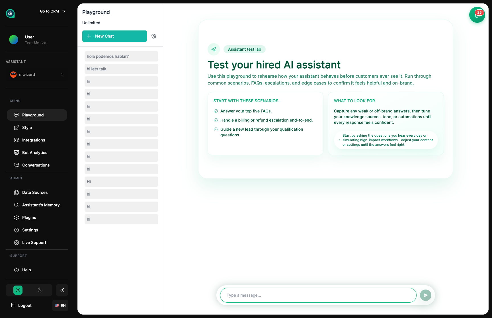
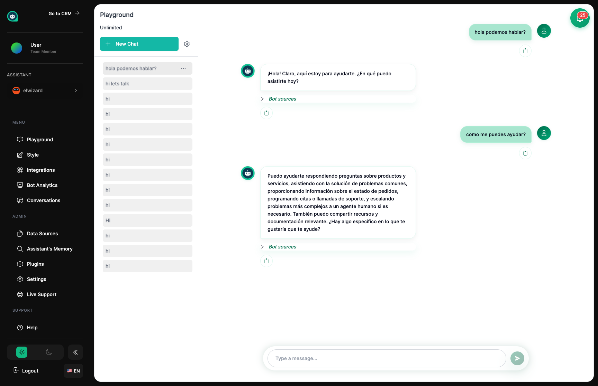

import { Aside, Badge, Card, CardGrid, LinkCard, Steps, Tabs, TabItem } from '@astrojs/starlight/components';

## La Sala de Entrevistas de Tu Asistente <Badge text="Interactivo" variant="tip" size="small" />

El Área de Pruebas es donde entrevistas y practicas con tu asistente antes de que comience a ayudar a clientes reales. Piensa en ello como un espacio de ensayo donde puedes hacerle preguntas, ver cómo responde y asegurarte de que está listo para el trabajo.

## Entrevistando a Tu Asistente

Usa el Área de Pruebas para tener una conversación con tu asistente, tal como lo haría un cliente. Hazle preguntas sobre tu negocio, prueba diferentes formas de expresar las cosas y observa si da respuestas útiles y precisas. Esto te ayuda a entender qué ha aprendido y dónde podría necesitar más entrenamiento.

<Aside type="tip" title="Consejos de Entrevista">
- Haz la misma pregunta de diferentes maneras – los clientes no siempre usarán las mismas palabras
- Prueba las preguntas reales que sabes que los clientes harán
- Si las respuestas no son del todo correctas, tu asistente podría necesitar más materiales de entrenamiento
- Observa cómo maneja saludos casuales y conversaciones informales también
</Aside>

## Revisando Sesiones de Práctica Anteriores

El Área de Pruebas mantiene un registro de tus conversaciones de práctica en la barra lateral. Puedes hacer clic en cualquier sesión anterior para revisar cómo fue, o iniciar una conversación nueva para probar desde cero.

## Herramientas a Tu Disposición

<CardGrid>
  <Card title="Nivel de Creatividad" icon="setting">
    Ajusta qué tan creativas vs. enfocadas son las respuestas de tu asistente. Más enfocado = respuestas consistentes. Más creativo = respuestas variadas.
  </Card>
  <Card title="Búsqueda Web en Vivo" icon="magnifier">
    Deja que tu asistente busque en internet información actual más allá de lo que le has enseñado.
  </Card>
  <Card title="Mostrar Fuentes" icon="document">
    Mira exactamente qué materiales de entrenamiento usó tu asistente para formar su respuesta.
  </Card>
</CardGrid>

<Aside type="note" title="Configuración de Creatividad">
<Tabs>
  <TabItem label="Más Enfocado (0.1-0.5)">
    **Creatividad baja** significa que tu asistente se apega a los hechos. Mejor para:
    - Responder preguntas de soporte
    - Proporcionar información precisa
    - Conversaciones de servicio al cliente
  </TabItem>
  <TabItem label="Más Creativo (0.6-1.0)">
    **Creatividad alta** significa que tu asistente es más flexible e inventivo. Mejor para:
    - Escribir mensajes de marketing
    - Lluvia de ideas
    - Interacciones más conversacionales
  </TabItem>
</Tabs>
</Aside>

## Sacando el Máximo de la Práctica

Haz de entrevistar a tu asistente un hábito regular. Pruébalo después de compartir nuevos materiales de entrenamiento, desafíalo con preguntas difíciles y experimenta con diferentes configuraciones hasta que estés seguro de que está listo para conocer clientes.

## Cómo Llevar una Buena Sesión de Práctica

<Steps>
1. **Sé sistemático**
   
   Haz una lista de preguntas comunes de clientes y trabaja con ellas. Cubre todos los temas importantes.

2. **Intenta confundirlo**
   
   Haz preguntas inusuales o complejas para encontrar sus puntos débiles antes que los clientes.

3. **Haz ajustes rápidos**
   
   Cuando algo no esté bien, actualiza su entrenamiento o configuración y prueba de nuevo inmediatamente.

4. **Toma notas**
   
   Escribe cualquier problema que encuentres para poder abordarlo después.
</Steps>

## Empezando de Nuevo

Haz clic en **Limpiar Chat** para comenzar una nueva conversación. Esto es útil cuando:

- Quieres ver cómo saluda a nuevos visitantes
- Estás probando algo específico sin contexto anterior
- Estás empezando un escenario de práctica completamente nuevo

<Aside type="tip" title="Consejo Pro">
Siempre empieza de nuevo cuando pruebes el saludo o primera impresión de tu asistente – ¡quieres ver lo que experimentarán los nuevos clientes!
</Aside>

## Temas Relacionados

<CardGrid>
  <LinkCard
    title="Configuración"
    description="Dale forma a la personalidad y estilo de respuesta de tu asistente"
    href="/es/assistants/settings/"
  />
  <LinkCard
    title="Fuentes de Datos"
    description="Añade más materiales de entrenamiento para mejorar las respuestas"
    href="/es/assistants/data-sources/"
  />
  <LinkCard
    title="Conversaciones"
    description="Mira cómo tu asistente se desempeña con clientes reales"
    href="/es/assistants/conversations/"
  />
  <LinkCard
    title="Analíticas"
    description="Rastrea el rendimiento general de tu asistente"
    href="/es/assistants/analytics/"
  />
</CardGrid>
