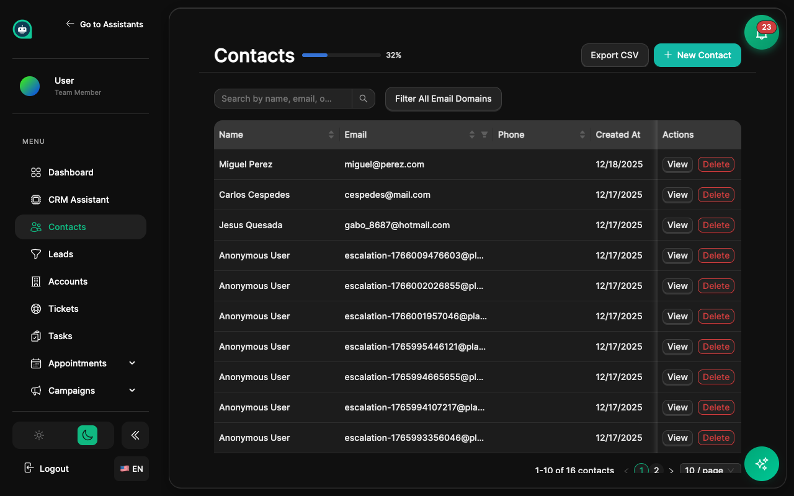

import { Aside, Badge, Card, CardGrid, LinkCard, Steps, Tabs, TabItem } from '@astrojs/starlight/components';

Los contactos son el corazón de tu CRM. Cada persona que interactúa con tus asistentes se convierte en un contacto con un perfil completo. <Badge text="Perfiles de Cliente" variant="tip" size="small" />

## Fuentes de Contactos

Los contactos se crean automáticamente desde:

<CardGrid>
  <Card title="Conversaciones de Chat" icon="comment">
    Cualquiera que chatee con tu asistente se convierte en contacto.
  </Card>
  <Card title="Reservas de Citas" icon="document">
    Los detalles de citas crean o actualizan contactos.
  </Card>
  <Card title="Envíos de Formularios" icon="pencil">
    Los formularios de captura de leads crean nuevos contactos.
  </Card>
  <Card title="Importación Manual" icon="add-document">
    Sube CSVs o crea contactos manualmente.
  </Card>
  <Card title="Integraciones" icon="external">
    Sincroniza desde otros CRMs o herramientas.
  </Card>
</CardGrid>

## Perfiles de Contacto

Cada contacto incluye:

<Tabs>
  <TabItem label="Información Básica">
    | Campo | Descripción |
    |-------|-------------|
    | **Nombre** | Nombre completo del contacto |
    | **Email** | Dirección de email principal |
    | **Teléfono** | Número de teléfono |
    | **Empresa** | Organización asociada |
    | **Zona Horaria** | Zona horaria preferida del contacto |
  </TabItem>
  <TabItem label="Historial de Actividad">
    | Actividad | Descripción |
    |-----------|-------------|
    | **Conversaciones** | Todas las sesiones de chat |
    | **Citas** | Reuniones reservadas |
    | **Tickets** | Solicitudes de soporte |
    | **Notas** | Anotaciones del equipo |
    | **Eventos** | Eventos del historial de actividad |
  </TabItem>
  <TabItem label="Datos de IA">
    | Métrica | Descripción |
    |---------|-------------|
    | **Sentimiento** | Estado de ánimo general basado en conversaciones |
    | **Puntuación de Lead** | Probabilidad de convertir (0-100) |
    | **Etiquetas** | Categorías automáticas y manuales |
    | **Segmentos** | Membresía en grupos |
  </TabItem>
</Tabs>

## Campos Personalizados

<Aside type="tip" title="Amplía tus Datos">
Crea campos personalizados para capturar información específica de tu negocio:
- **Texto** - Nombre de empresa, título del puesto
- **Número** - Valor del contrato, puntuación
- **Fecha** - Fecha de renovación, cumpleaños
- **Selección** - Industria, fuente, estado
- **Multi-selección** - Productos de interés, canales
</Aside>

## Importar Contactos

<Steps>
1. **Ve a Contactos**
   
   Navega a **CRM** → **Contactos** desde la barra lateral.

2. **Haz clic en Importar**
   
   Selecciona el botón de importar en la parte superior.

3. **Sube tu archivo CSV**
   
   Arrastra tu archivo o selecciónalo de tu computadora.

4. **Mapea los campos**
   
   Asocia las columnas de tu CSV a los campos de contacto.

5. **Revisa y confirma**
   
   Verifica los datos antes de importar.

6. **Completa la importación**
   
   Los contactos se crean o actualizan según el email.
</Steps>

<Aside type="note" title="Duplicados">
Los contactos se identifican por email. Si importas un email que ya existe, el contacto se actualiza en lugar de crear un duplicado.
</Aside>

## Exportar Contactos

Exporta tus contactos en varios formatos:

<CardGrid>
  <Card title="CSV" icon="external">
    Para hojas de cálculo y otros CRMs.
  </Card>
  <Card title="JSON" icon="document">
    Para integraciones técnicas.
  </Card>
</CardGrid>

## Cumplimiento GDPR

<Aside type="caution" title="Protección de Datos">
Respeta los derechos de tus contactos:
- **Derecho de acceso** - Los contactos pueden solicitar sus datos
- **Derecho de rectificación** - Corrige datos inexactos
- **Derecho de eliminación** - Anonimiza o elimina contactos
- **Derecho de portabilidad** - Exporta datos en formato estándar
</Aside>

<Steps>
1. **Solicitud de eliminación**
   
   Usa el botón "Anonimizar" en el perfil del contacto.

2. **Datos anonimizados**
   
   El email se convierte en `deleted_xxx@anonymized.local`, el nombre en `GDPR_ERASED_USER`.

3. **Historial preservado**
   
   Las estadísticas agregadas se mantienen sin datos personales.
</Steps>

## Temas Relacionados

<CardGrid>
  <LinkCard 
    title="Segmentos" 
    description="Agrupa contactos por comportamiento"
    href="/es/crm/segments/"
  />
  <LinkCard 
    title="Flujos de Trabajo" 
    description="Automatiza acciones sobre contactos"
    href="/es/crm/workflows/"
  />
</CardGrid>
