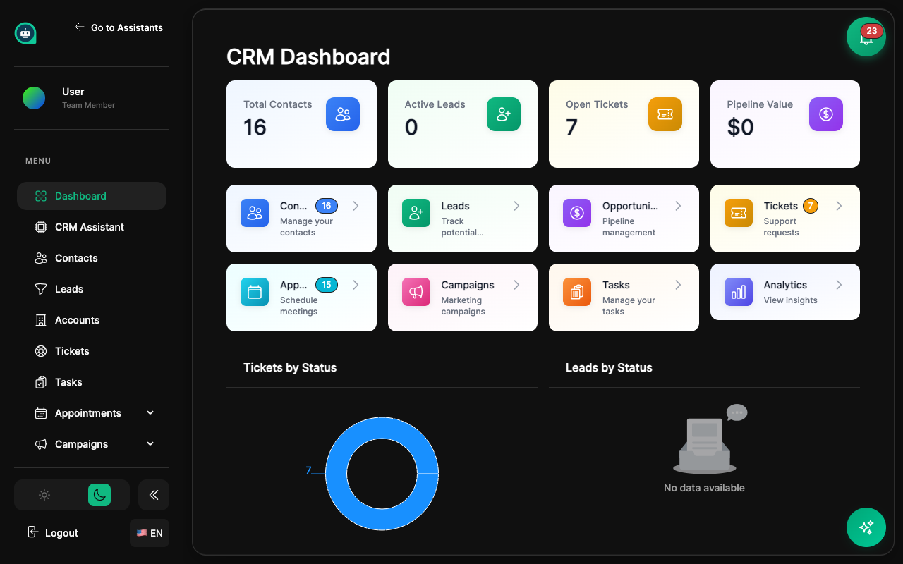

import { Aside, Badge, Card, CardGrid, LinkCard, Steps } from '@astrojs/starlight/components';

El CRM de MyGPTAssistants te ayuda a gestionar contactos, rastrear conversaciones y automatizar flujos de trabajo, todo potenciado por IA. <Badge text="Inteligencia de Cliente" variant="success" size="small" />

## ¿Por Qué Usar el CRM?

<CardGrid>
  <Card title="Vista Unificada del Cliente" icon="group">
    Todos los datos de clientes en un solo lugar: conversaciones, citas, tickets y más.
  </Card>
  <Card title="Insights con IA" icon="rocket">
    Análisis automático de sentimientos, puntuación de leads y segmentación inteligente.
  </Card>
  <Card title="Automatización" icon="setting">
    Automatiza tareas repetitivas con flujos de trabajo y disparadores.
  </Card>
  <Card title="Integraciones" icon="external">
    Conecta con tus herramientas existentes: Calendly, Stripe, HubSpot y más.
  </Card>
</CardGrid>

## Funcionalidades Principales

<CardGrid>
  <LinkCard 
    title="Contactos" 
    description="Gestiona perfiles de clientes y su historial de interacciones"
    href="/es/crm/contacts/"
  />
  <LinkCard 
    title="Pipelines" 
    description="Rastrea leads y oportunidades a través de etapas"
    href="/es/crm/pipelines/"
  />
  <LinkCard 
    title="Segmentos" 
    description="Agrupa contactos basándote en comportamiento y atributos"
    href="/es/crm/segments/"
  />
  <LinkCard 
    title="Flujos de Trabajo" 
    description="Automatiza acciones basadas en eventos y condiciones"
    href="/es/crm/workflows/"
  />
  <LinkCard 
    title="Reportes" 
    description="Analiza tu negocio con reportes integrados"
    href="/es/crm/reports/"
  />
</CardGrid>

## Integración con IA

<Aside type="tip" title="Potenciado por IA">
El CRM aprovecha tus asistentes de IA para proporcionar:
- **Análisis de sentimientos** - Detecta automáticamente el estado de ánimo del cliente en conversaciones
- **Puntuación de leads** - Prioriza leads basándote en compromiso e intención
- **Etiquetado inteligente** - Categorización automática de contactos
- **Resumen de conversaciones** - Resúmenes instantáneos de chats largos
</Aside>

## Empezando

<Steps>
1. **Importa tus contactos**
   
   Sube un CSV o conecta tu CRM existente para importar contactos.

2. **Configura tu pipeline**
   
   Crea etapas que coincidan con tu proceso de ventas.

3. **Crea segmentos**
   
   Agrupa contactos por comportamiento, atributos o etiquetas.

4. **Automatiza flujos de trabajo**
   
   Configura acciones automáticas basadas en eventos.

5. **Revisa reportes**
   
   Monitorea métricas y optimiza tu estrategia.
</Steps>

## Temas Relacionados

<CardGrid>
  <LinkCard 
    title="Conversaciones" 
    description="Gestiona chats con tus asistentes"
    href="/es/assistants/conversations/"
  />
  <LinkCard 
    title="Analytics" 
    description="Métricas de rendimiento de asistentes"
    href="/es/assistants/analytics/"
  />
</CardGrid>
