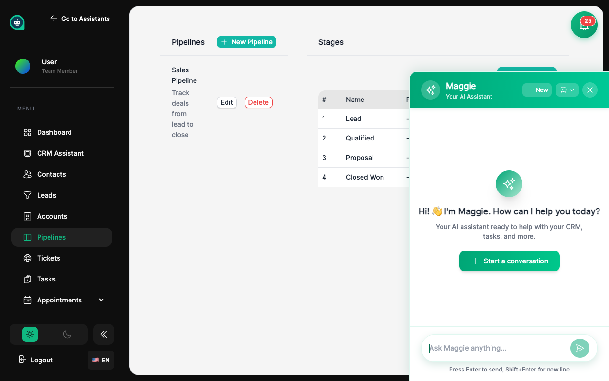

import { Aside, Badge, Card, CardGrid, LinkCard, Steps, Tabs, TabItem } from '@astrojs/starlight/components';

Los pipelines te ayudan a visualizar y gestionar tu proceso de ventas. Rastrea leads desde el primer contacto hasta el cierre. <Badge text="Gestión de Ventas" variant="success" size="small" />

## Cómo Funcionan los Pipelines

<CardGrid>
  <Card title="Etapas" icon="bars">
    Pasos en tu proceso de ventas (ej: Lead → Calificado → Propuesta → Cerrado).
  </Card>
  <Card title="Oportunidades" icon="rocket">
    Deals individuales moviéndose a través de las etapas.
  </Card>
  <Card title="Valores" icon="approve">
    Valor monetario asociado a cada oportunidad.
  </Card>
  <Card title="Probabilidades" icon="setting">
    Probabilidad de cierre por etapa.
  </Card>
</CardGrid>

## Creando un Pipeline

<Steps>
1. **Ve a Pipelines**
   
   Navega a **CRM** → **Pipelines** desde la barra lateral.

2. **Haz clic en Crear Pipeline**
   
   Inicia la configuración de un nuevo pipeline.

3. **Nombra tu pipeline**
   
   Ej: "Ventas B2B", "Soporte de Tickets", "Proceso de Reclutamiento".

4. **Define las etapas**
   
   Crea las etapas que representan tu proceso.

5. **Configura probabilidades**
   
   Asigna porcentajes de probabilidad a cada etapa.

6. **Guarda y activa**
   
   Tu pipeline está listo para usar.
</Steps>

## Configuración de Etapas

<Tabs>
  <TabItem label="Pipeline de Ventas">
    | Etapa | Probabilidad | Descripción |
    |-------|--------------|-------------|
    | **Nuevo Lead** | 10% | Contacto inicial |
    | **Calificado** | 25% | Necesidades confirmadas |
    | **Propuesta** | 50% | Cotización enviada |
    | **Negociación** | 75% | Términos en discusión |
    | **Cerrado Ganado** | 100% | Deal completado |
    | **Cerrado Perdido** | 0% | Oportunidad perdida |
  </TabItem>
  <TabItem label="Pipeline de Soporte">
    | Etapa | Descripción |
    |-------|-------------|
    | **Nuevo** | Ticket recién creado |
    | **En Progreso** | Agente trabajando |
    | **Esperando Cliente** | Necesita respuesta |
    | **Resuelto** | Solución implementada |
    | **Cerrado** | Ticket completado |
  </TabItem>
</Tabs>

## Gestionando Oportunidades

<CardGrid>
  <Card title="Crear Manualmente" icon="add-document">
    Agrega oportunidades desde el panel de pipelines.
  </Card>
  <Card title="Desde Conversaciones" icon="comment">
    Convierte chats en oportunidades con un clic.
  </Card>
  <Card title="Automáticamente" icon="setting">
    Los flujos de trabajo pueden crear oportunidades.
  </Card>
  <Card title="Desde Citas" icon="document">
    Citas reservadas crean oportunidades.
  </Card>
</CardGrid>

<Aside type="tip" title="Arrastra y Suelta">
Mueve oportunidades entre etapas arrastrándolas en la vista de tablero Kanban.
</Aside>

## Métricas del Pipeline

<CardGrid>
  <Card title="Valor Total" icon="approve">
    Suma de todas las oportunidades activas.
  </Card>
  <Card title="Valor Ponderado" icon="setting">
    Total × probabilidad de cada etapa.
  </Card>
  <Card title="Tasa de Conversión" icon="graph">
    Porcentaje de leads que cierran.
  </Card>
  <Card title="Tiempo en Etapa" icon="document">
    Días promedio en cada etapa.
  </Card>
</CardGrid>

## Automatización de Pipeline

Conecta tus pipelines con flujos de trabajo:

<Tabs>
  <TabItem label="Disparadores">
    | Evento | Acción Típica |
    |--------|---------------|
    | Lead creado | Enviar email de bienvenida |
    | Etapa cambiada | Notificar al vendedor |
    | Valor actualizado | Actualizar forecasting |
    | Deal cerrado | Crear factura |
  </TabItem>
  <TabItem label="Acciones">
    | Acción | Descripción |
    |--------|-------------|
    | Mover etapa | Cambiar etapa automáticamente |
    | Asignar | Asignar a vendedor específico |
    | Crear tarea | Generar follow-up |
    | Enviar email | Comunicación automática |
  </TabItem>
</Tabs>

## Temas Relacionados

<CardGrid>
  <LinkCard 
    title="Flujos de Trabajo" 
    description="Automatiza acciones del pipeline"
    href="/es/crm/workflows/"
  />
  <LinkCard 
    title="Reportes" 
    description="Analiza rendimiento de ventas"
    href="/es/crm/reports/"
  />
</CardGrid>
