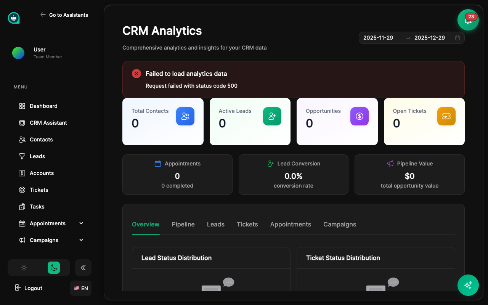

import { Aside, Badge, Card, CardGrid, LinkCard, Steps, Tabs, TabItem } from '@astrojs/starlight/components';

Obtén insights de tu negocio con reportes completos. <Badge text="Analytics" variant="tip" size="small" />

## Tipos de Reportes

<CardGrid>
  <Card title="Reportes de Contactos" icon="group">
    **<Badge text="En Vivo" variant="success" size="small" />**
    
    Total de contactos, fuentes, distribución geográfica, análisis de etiquetas, tasa de crecimiento.
  </Card>
  <Card title="Reportes de Conversaciones" icon="comment">
    **<Badge text="En Vivo" variant="success" size="small" />**
    
    Volumen por bot/canal, tasas de resolución, duración, horas pico.
  </Card>
  <Card title="Reportes de Tickets" icon="document">
    Abiertos vs resueltos, desglose por prioridad, estadísticas de asignados, cumplimiento de SLA.
  </Card>
  <Card title="Reportes de Campañas" icon="email">
    Tasas de apertura, tasas de clic, conversiones, mejor contenido, timing óptimo.
  </Card>
  <Card title="Reportes de Leads" icon="rocket">
    Fuentes de leads, etapas del pipeline, tasas de conversión, velocidad, ganados/perdidos.
  </Card>
  <Card title="Reportes Personalizados" icon="setting">
    **<Badge text="Flexible" variant="note" size="small" />**
    
    Construye reportes con cualquier dato, métricas y dimensiones.
  </Card>
</CardGrid>

## Construyendo Reportes

<Tabs>
  <TabItem label="Reportes Rápidos">
    **Reportes pre-construidos listos para usar**
    
    <Steps>
    1. **Ve a Reportes**
       
       Navega a la sección de Reportes desde la barra lateral.
    
    2. **Selecciona tipo de reporte**
       
       Elige entre Contactos, Conversaciones, Tickets, Campañas o Leads.
    
    3. **Elige rango de fechas**
       
       Establece el período de tiempo que quieres analizar.
    
    4. **Ver resultados**
       
       Ve tus datos visualizados instantáneamente.
    </Steps>
  </TabItem>
  <TabItem label="Reportes Personalizados">
    **Construye tus propios reportes** <Badge text="Avanzado" variant="note" size="small" />
    
    <Steps>
    1. **Haz clic en + Nuevo Reporte**
       
       Inicia una configuración de reporte personalizado.
    
    2. **Selecciona fuente de datos**
       
       Elige sobre qué datos reportar.
    
    3. **Elige métricas**
       
       Selecciona qué medir (conteos, promedios, tasas).
    
    4. **Agrega dimensiones**
       
       Define cómo agrupar los datos.
    
    5. **Aplica filtros**
       
       Reduce a criterios específicos.
    
    6. **Guarda el reporte**
       
       Nombra y guarda para acceso futuro.
    </Steps>
  </TabItem>
</Tabs>

<Aside type="tip" title="Construcción de Reportes">
- **Empieza con reportes pre-construidos** y personaliza desde ahí
- **Guarda reportes frecuentes** para acceso rápido
- **Comparte reportes** con miembros del equipo para colaboración
</Aside>

## Componentes del Reporte

<Tabs>
  <TabItem label="Métricas">
    **Qué medir**
    
    | Tipo de Métrica | Ejemplos |
    |-----------------|----------|
    | **Conteo** | Total de contactos, mensajes |
    | **Suma** | Ingresos totales, horas |
    | **Promedio** | Tiempo promedio de respuesta |
    | **Porcentaje** | Tasa de conversión |
    | **Tasa** | Mensajes por hora |
  </TabItem>
  <TabItem label="Dimensiones">
    **Cómo agrupar datos**
    
    | Dimensión | Caso de Uso |
    |-----------|-------------|
    | **Fecha/Hora** | Tendencias en el tiempo |
    | **Categoría** | Por tipo o estado |
    | **Usuario/Asignado** | Rendimiento del equipo |
    | **Segmento** | Grupos de clientes |
    | **Plataforma** | Comparación de canales |
  </TabItem>
  <TabItem label="Filtros">
    **Qué incluir**
    
    | Tipo de Filtro | Ejemplo |
    |----------------|---------|
    | **Rango de fechas** | Últimos 30 días |
    | **Valores específicos** | Estado = "Abierto" |
    | **Condiciones** | Valor > $1,000 |
    | **Segmentos** | Solo clientes VIP |
  </TabItem>
</Tabs>

## Visualizaciones

<CardGrid>
  <Card title="Gráficos de Línea" icon="graph">
    Muestra tendencias y cambios en el tiempo.
  </Card>
  <Card title="Gráficos de Barras" icon="bars">
    Compara valores entre categorías.
  </Card>
  <Card title="Gráficos de Pastel" icon="approve">
    Muestra proporciones y porcentajes.
  </Card>
  <Card title="Tablas" icon="document">
    Datos detallados con ordenamiento y filtrado.
  </Card>
  <Card title="Métricas Clave" icon="rocket">
    Números individuales para KPIs y destacados.
  </Card>
</CardGrid>

## Dashboards <Badge text="Vista General" variant="success" size="small" />

Crea dashboards personalizados combinando múltiples reportes para una vista completa de tu negocio.

<CardGrid>
  <Card title="Dashboard de Ventas" icon="approve">
    Valor del pipeline, deals cerrados, tasas de conversión.
  </Card>
  <Card title="Dashboard de Soporte" icon="document">
    Tickets abiertos, tiempos de respuesta, satisfacción.
  </Card>
  <Card title="Dashboard de Marketing" icon="email">
    Rendimiento de campañas, fuentes de leads, engagement.
  </Card>
  <Card title="Dashboard Ejecutivo" icon="graph">
    KPIs de alto nivel de todos los departamentos.
  </Card>
</CardGrid>

<Aside type="tip" title="Estrategia de Dashboards">
- **Crea dashboards específicos por rol** (ventas, soporte, marketing)
- **Incluye métricas clave arriba** para escaneo rápido
- **Actualiza dashboards regularmente** según cambien las necesidades del negocio
</Aside>

## Exportando Datos

<CardGrid>
  <Card title="Exportar CSV" icon="external">
    Para análisis en hojas de cálculo y manipulación de datos.
  </Card>
  <Card title="Exportar PDF" icon="document">
    Para compartir reportes pulidos con stakeholders.
  </Card>
  <Card title="Email Programado" icon="email">
    **<Badge text="Automatizado" variant="success" size="small" />**
    
    Entrega automática a tu inbox diaria/semanal.
  </Card>
</CardGrid>

## Temas Relacionados

<CardGrid>
  <LinkCard 
    title="Analytics de Asistentes" 
    description="Métricas de rendimiento de asistentes"
    href="/es/assistants/analytics/"
  />
  <LinkCard 
    title="Pipelines" 
    description="Reportes de pipeline de ventas"
    href="/es/crm/pipelines/"
  />
</CardGrid>
