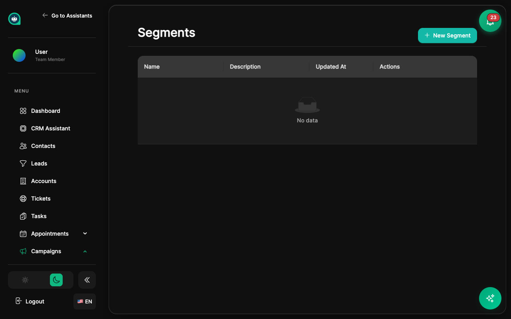

import { Aside, Badge, Card, CardGrid, LinkCard, Steps, Tabs, TabItem } from '@astrojs/starlight/components';

Los segmentos te permiten agrupar contactos dinámicamente basándote en criterios específicos. Perfectos para marketing dirigido y personalización. <Badge text="Targeting Inteligente" variant="tip" size="small" />

## ¿Qué son los Segmentos?

<CardGrid>
  <Card title="Grupos Dinámicos" icon="group">
    Los contactos entran y salen automáticamente según cumplan los criterios.
  </Card>
  <Card title="Actualización en Tiempo Real" icon="rocket">
    Los segmentos se actualizan instantáneamente cuando cambian los datos.
  </Card>
  <Card title="Reglas Combinadas" icon="setting">
    Usa AND/OR para crear segmentos complejos.
  </Card>
</CardGrid>

## Tipos de Filtros

<Tabs>
  <TabItem label="Propiedades">
    **Filtros basados en datos del contacto**
    
    | Filtro | Ejemplo |
    |--------|---------|
    | **Nombre/Email** | Contiene "empresa.com" |
    | **Fecha de creación** | En los últimos 30 días |
    | **Campos personalizados** | Industria = "Tecnología" |
    | **Etiquetas** | Tiene etiqueta "VIP" |
    | **País/Ubicación** | País = "México" |
  </TabItem>
  <TabItem label="Comportamiento">
    **Filtros basados en acciones**
    
    | Filtro | Ejemplo |
    |--------|---------|
    | **Conversaciones** | Más de 5 chats |
    | **Último mensaje** | En los últimos 7 días |
    | **Sentimiento** | Sentimiento negativo detectado |
    | **Citas** | Ha reservado cita |
    | **Compras** | Ha completado compra |
  </TabItem>
  <TabItem label="CRM">
    **Filtros basados en datos del CRM**
    
    | Filtro | Ejemplo |
    |--------|---------|
    | **Etapa del pipeline** | En "Propuesta" |
    | **Valor del deal** | Mayor a $10,000 |
    | **Puntuación de lead** | Mayor a 70 |
    | **Asignado a** | Usuario específico |
    | **Estado del ticket** | Tickets abiertos |
  </TabItem>
</Tabs>

## Creando Segmentos

<Steps>
1. **Ve a Segmentos**
   
   Navega a **CRM** → **Segmentos** desde la barra lateral.

2. **Haz clic en Crear Segmento**
   
   Inicia la configuración de un nuevo segmento.

3. **Nombra tu segmento**
   
   Usa un nombre descriptivo: "Leads Calientes Q1", "Clientes VIP".

4. **Agrega filtros**
   
   Selecciona los criterios que definen el segmento.

5. **Combina con AND/OR**
   
   Usa operadores lógicos para filtros complejos.

6. **Previsualiza resultados**
   
   Revisa qué contactos coinciden antes de guardar.

7. **Guarda el segmento**
   
   El segmento se actualizará automáticamente.
</Steps>

<Aside type="tip" title="Lógica de Filtros">
- **AND** - Todas las condiciones deben cumplirse
- **OR** - Al menos una condición debe cumplirse
- **Grupos** - Combina AND y OR con paréntesis lógicos
</Aside>

## Ejemplos de Segmentos

<Tabs>
  <TabItem label="Leads Calientes">
    **Contactos listos para comprar**
    
    Criterios:
    - Puntuación de lead > 70 **AND**
    - Última actividad < 7 días **AND**
    - NO tiene etiqueta "No contactar"
  </TabItem>
  <TabItem label="Clientes VIP">
    **Clientes de alto valor**
    
    Criterios:
    - Valor total de compras > $5,000 **OR**
    - Plan = "Enterprise" **OR**
    - Tiene etiqueta "VIP"
  </TabItem>
  <TabItem label="En Riesgo">
    **Clientes que necesitan atención**
    
    Criterios:
    - Última actividad > 30 días **AND**
    - Sentimiento = "Negativo" **OR**
    - Tickets abiertos > 0
  </TabItem>
  <TabItem label="Nuevos Usuarios">
    **Contactos recientes**
    
    Criterios:
    - Fecha de creación < 14 días **AND**
    - Conversaciones > 0 **AND**
    - NO es cliente pagado
  </TabItem>
</Tabs>

## Usando Segmentos

<CardGrid>
  <Card title="Campañas de Email" icon="email">
    Envía emails dirigidos a segmentos específicos.
  </Card>
  <Card title="Flujos de Trabajo" icon="setting">
    Dispara automatizaciones cuando contactos entran/salen de segmentos.
  </Card>
  <Card title="Personalización" icon="pencil">
    Personaliza la experiencia del asistente por segmento.
  </Card>
  <Card title="Reportes" icon="graph">
    Analiza métricas por segmento.
  </Card>
</CardGrid>

## Automatización con Segmentos

<Aside type="tip" title="Disparadores de Segmento">
Configura flujos de trabajo que se activan cuando:
- Un contacto **entra** a un segmento
- Un contacto **sale** de un segmento
- El tamaño del segmento alcanza un umbral
</Aside>

## Temas Relacionados

<CardGrid>
  <LinkCard 
    title="Contactos" 
    description="Gestiona perfiles de clientes"
    href="/es/crm/contacts/"
  />
  <LinkCard 
    title="Flujos de Trabajo" 
    description="Automatiza con segmentos"
    href="/es/crm/workflows/"
  />
</CardGrid>
